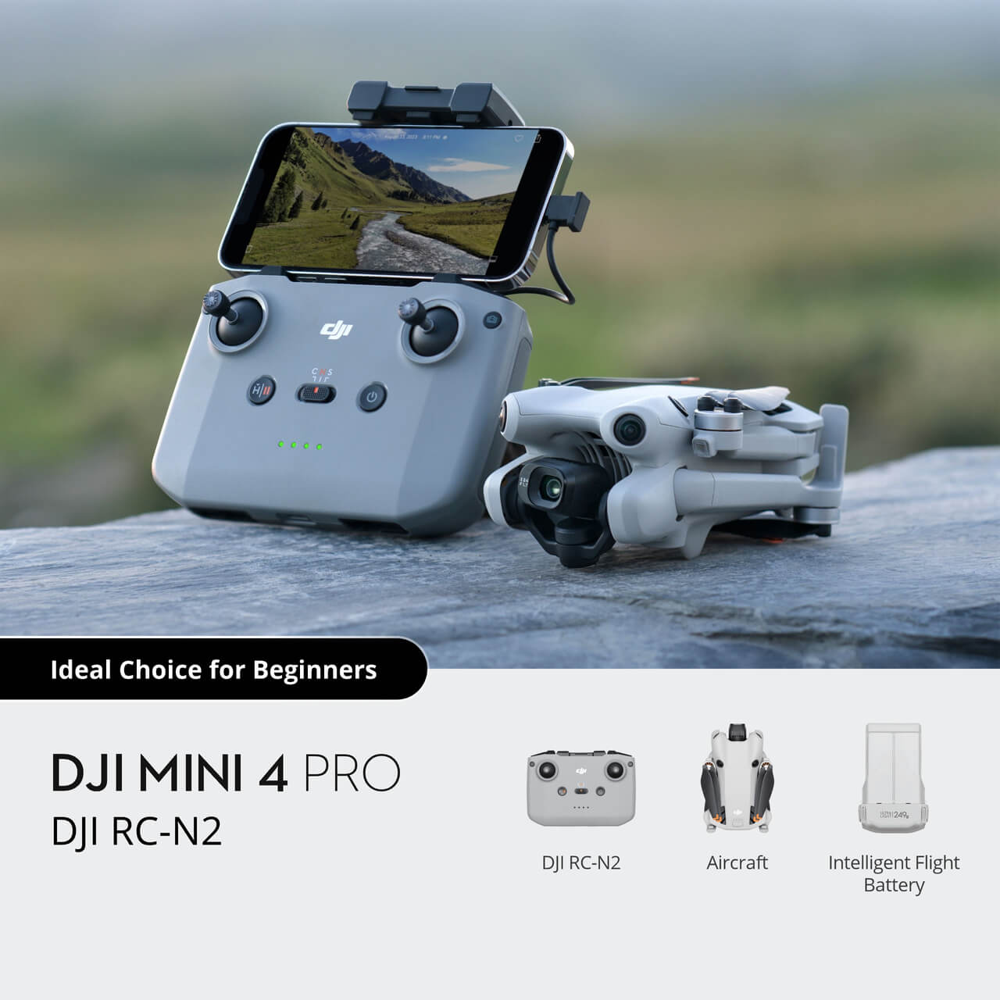
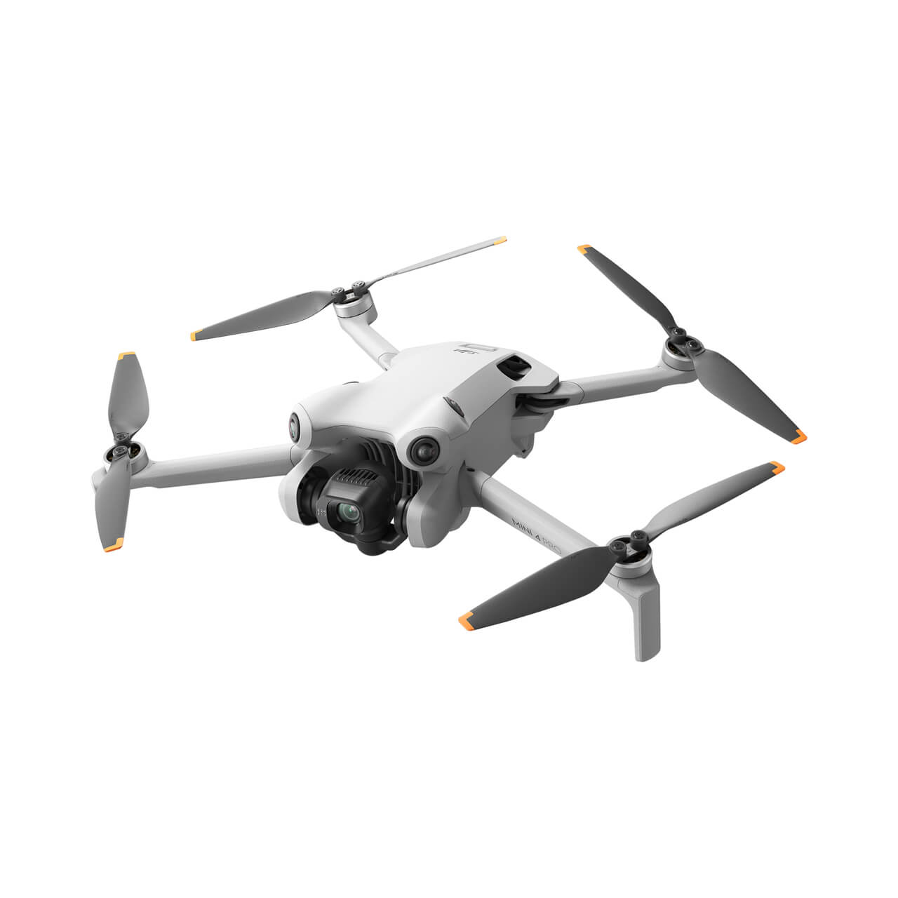
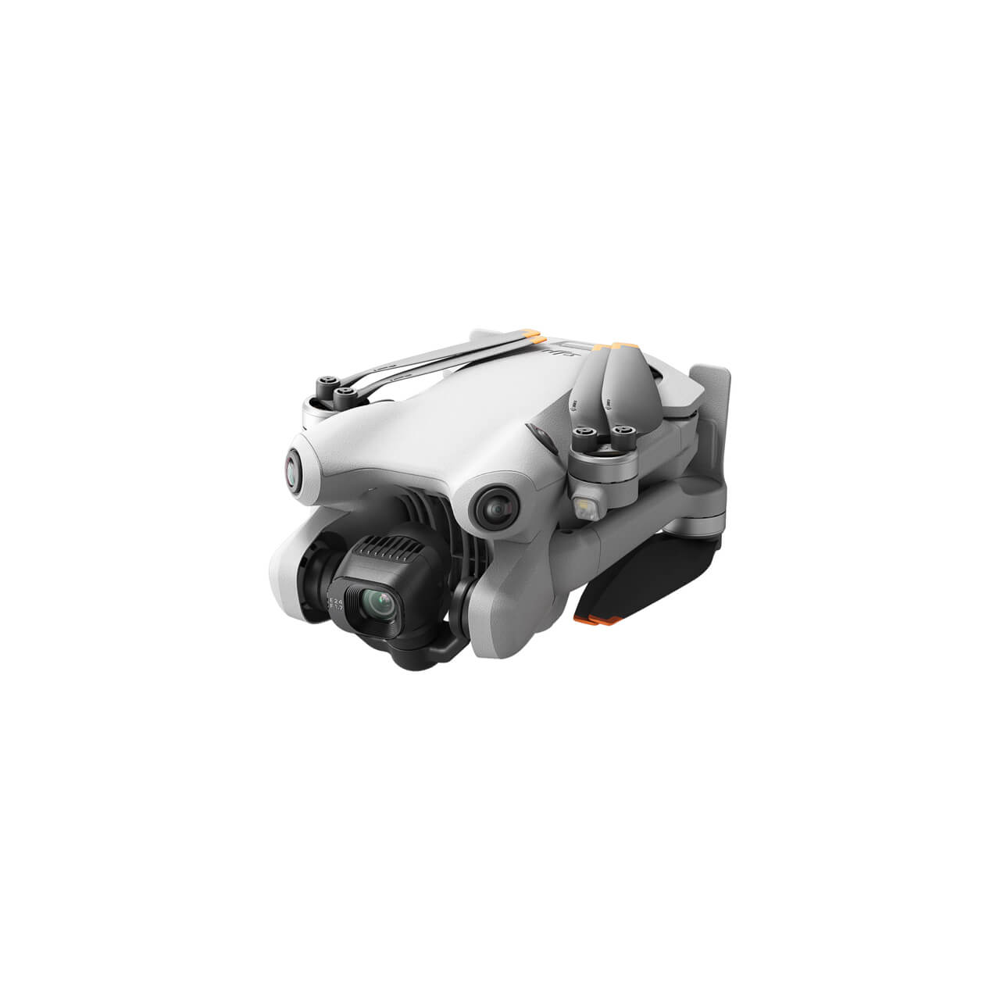
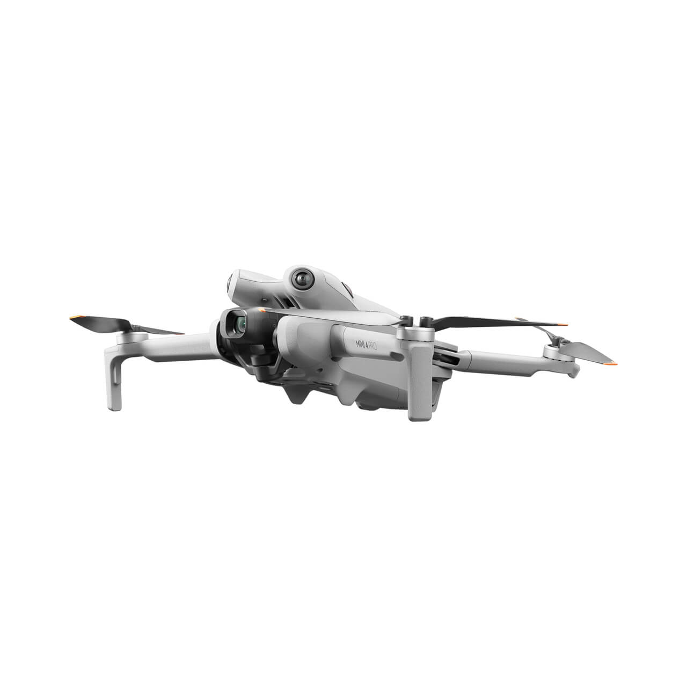
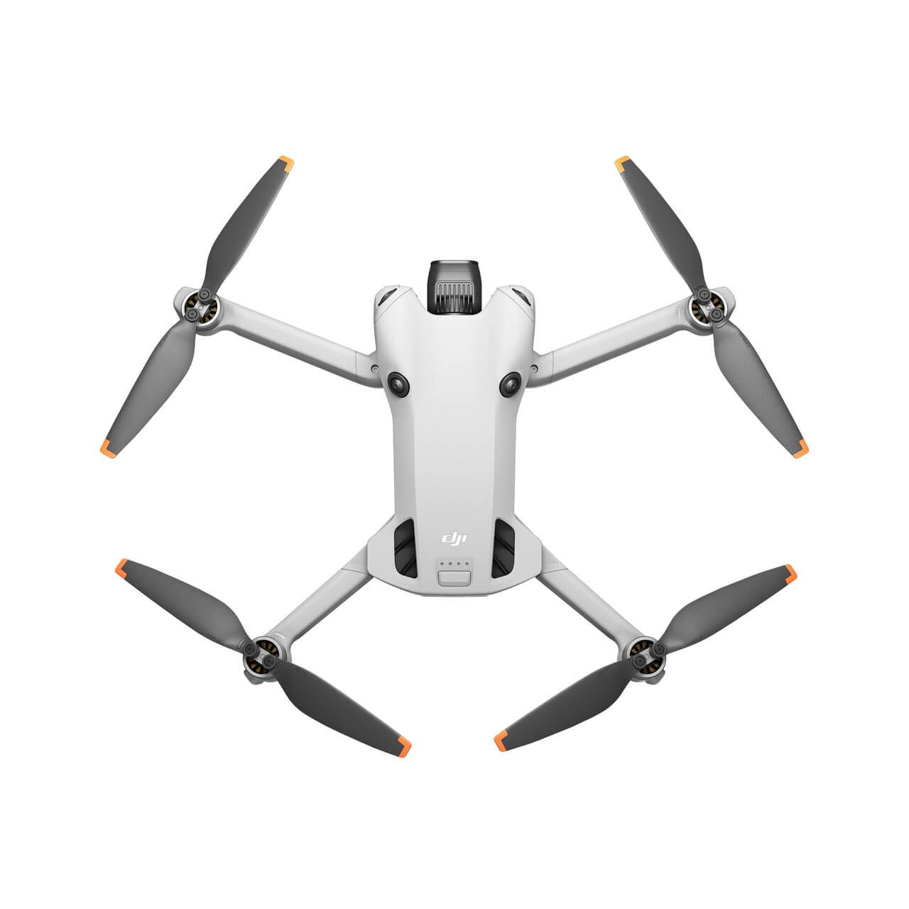
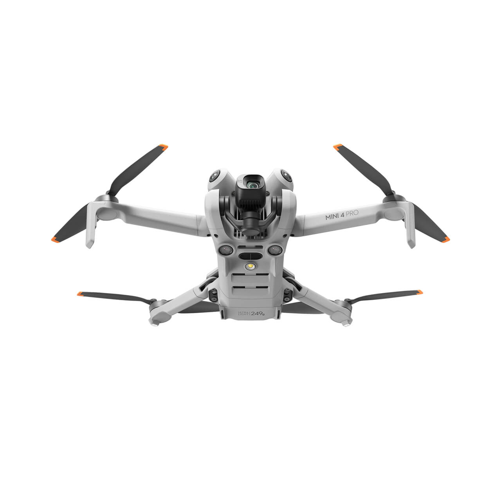
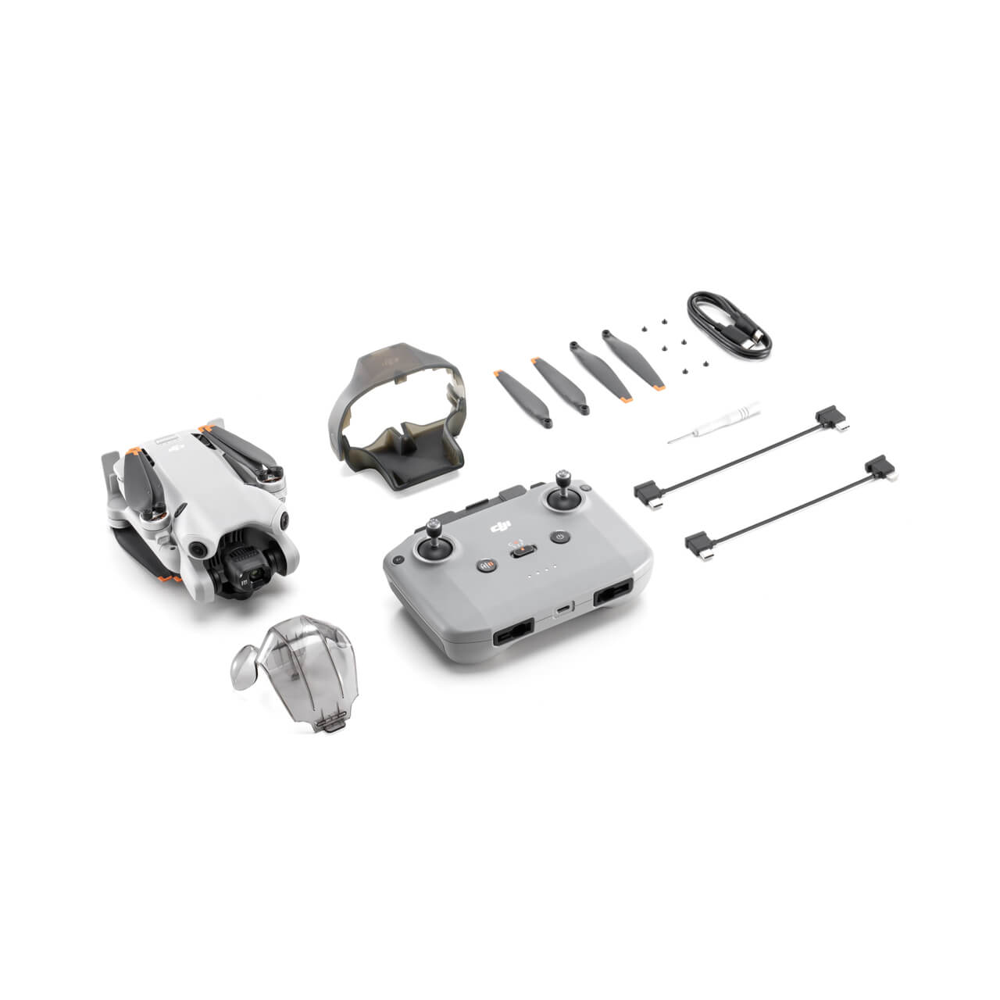

# 📅 [Phase 2] 지능형 드론 관제 파이프라인 프로젝트 상세 일정표

> 📌 **Phase 3 일정 바로가기:** [2026.08.19 ~ 2026.09.09 3차 프로젝트 상세 작업 일정표](PHASE3_SCHEDULE.md) — 최종 발표일 09.09 확정 반영

---

## 프로젝트 기간: 2026.07.13 ~ 2026.07.30

> **일정 현행화 기준일: 2026.07.28**
> 본 일정표는 프로젝트 착수 당시 계획표가 아니라, **현재까지 실제로 진행한 개발·검증 내역과 남은 일정을 기준으로 재작성한 실행 일정표**입니다.

### 📌 프로젝트 범위

- **2차 프로젝트:** 브라우저·스마트폰·시험 영상 기반 가상 드론을 활용한 지능형 관제 파이프라인 구현 및 통합 검증
- **3차 프로젝트 연계:** DJI Mini 4 Pro 실기체 영상·비행 데이터 연동, 무선 관제 및 현장 시연으로 확장

### 🏷️ 진행 상태 표기

| 표기 | 의미 |
|:---:|---|
| ✅ **완료** | 구현 및 기본 검증 완료 |
| 🟡 **보완 중** | 핵심 기능은 구현했으나 통합 안정화 또는 재검증 필요 |
| 🔴 **차단 이슈** | 오류 원인을 확인했으며 해결 또는 수용 테스트가 필요한 상태 |
| 🔵 **예정** | 남은 프로젝트 기간에 수행할 작업 |
| 🚀 **Phase 3** | 실제 드론 연계 단계로 이관한 확장 작업 |

---

## 🗓️ 실제 진행 기준 상세 일정

| 날짜 | 요일 | 주요 작업 목표 (Milestone) | 실제 진행 내역 및 세부 태스크 | 상태 |
|:---:|:---:|---|---|:---:|
| **07.13** | 월 | **프로젝트 방향 및 성장형 구조 수립** | - 지능형 드론 관제 프로젝트 주제와 핵심 목표 정의 - 가상 드론 기반 2차 프로젝트와 DJI 실기체 기반 3차 프로젝트의 연계 구조 설계 - 프로젝트 README 및 아키텍처 초안 작성 | ✅ **완료** |
| **07.14** | 화 | **요구사항 분석 및 데이터 흐름 설계** | - 영상, 텔레메트리, AI 분석 결과, 관제 이벤트의 전체 흐름 정리 - 드론 관리, 비행 세션, 실시간 위치, 이력 조회 등 핵심 도메인 도출 - AI 서버·백엔드·프론트엔드·DB 역할 분리 | ✅ **완료** |
| **07.15** | 수 | **저장소 및 개발 환경 기반 구성** | - `VisionFlow-Drone` 모노레포 디렉터리 구조 정비 - Frontend, Backend, AI Server, Infrastructure 영역 분리 - Docker 기반 MySQL 개발 환경과 환경변수 구성 점검 | ✅ **완료** |
| **07.16** | 목 | **기술 스택 및 시스템 아키텍처 확정** | - Frontend: Next.js·React·TypeScript 확정 - Backend: Java 21·Spring Boot·JPA·Flyway 확정 - AI Server: Python 3.11·FastAPI·YOLO·OpenCV 확정 - 2차 프로젝트는 가상 입력으로 파이프라인을 먼저 검증하고, 실기체 연결은 3차로 확장하는 전략 확정 | ✅ **완료** |
| **07.17** | 금 | **드론 관리 백엔드 구축** | - Flyway 기반 `drone` 테이블 마이그레이션 작성 - Entity, Enum, DTO, Repository, Service, Controller 구현 - 드론 등록·조회·수정·상태 변경·삭제 API 구성 - API 응답 구조 및 예외 처리 정비 | ✅ **완료** |
| **07.18** | 토 | **드론 관리 UI 및 실시간 텔레메트리 연동** | - Next.js `/drones` 목록·필터·등록·수정·삭제 화면 구현 - `/drones/[id]` 상세 관제 화면과 자동 갱신 기능 구현 - Spring WebSocket과 Next.js 실시간 텔레메트리 수신 연결 - 5초 폴링을 WebSocket 장애 시 대체 수단으로 유지 - ESLint 및 Backend 컴파일 오류 수정 | ✅ **완료** |
| **07.19** | 일 | **관제 화면 안정화 및 코드 품질 개선** | - 드론 관리 메뉴 404, 라우팅 및 화면 진입 문제 점검 - React Effect·상태 갱신 관련 ESLint 오류 수정 - 공통 API 호출, 로딩·오류 화면 및 타입 안정성 보완 - Frontend lint/build 반복 검증 | ✅ **완료** |
| **07.20** | 월 | **텔레메트리 이력 저장 및 경로 조회 구현** | - 위도·경도·고도·배터리·접속 시각 텔레메트리 갱신 API 구현 - MySQL 텔레메트리 이력 저장 기능 구현 - 드론별 과거 비행 경로 조회 API 구현 - Backend 서비스 의존성 및 컴파일 오류 해결 | ✅ **완료** |
| **07.21** | 화 | **실시간 관제 지도 및 경로 리플레이 구현** | - 과거 경로와 실시간 경로를 연결해 지도에 표시 - 드론 경로 재생 컨트롤과 재생 상태 로직 구현 - 함대 단위 텔레메트리 훅 및 전체·비행 중·통신 지연 요약 구현 - TypeScript null 처리와 초기 데이터 배열 오류 수정 | ✅ **완료** |
| **07.22** | 수 | **FastAPI AI 서버 및 프록시 연동 기반 구축** | - FastAPI AI 서버 실행 구조와 API 문서 확인 - AI 스트림 상태 및 프레임 수집 API용 Next.js 프록시 구성 - `ECONNREFUSED`, 포트 불일치, AI 서버 미실행으로 발생한 502 오류 원인 분석 및 실행 절차 정리 - Python 의존성, pytest, ruff 환경 점검 | ✅ **기반 완료** |
| **07.23** | 목 | **가상 드론·비행 세션 통합 검증** | - PC 수동 모드 기반 가상 드론 관제 흐름 검증 - 비행 세션 생성·상태 변경 API와 화면 흐름 연동 - 실제 세션 UUID 대신 임시 값을 사용해 발생한 404 원인 확인 - 비행 세션 생성 과정의 500 오류 및 통합 상태 점검 | 🟡 **보완 중** |
| **07.24** | 금 | **브라우저·스마트폰 영상 입력 검증** | - 브라우저 카메라 프레임을 AI 서버로 전달하는 수집 흐름 구성 - AI 프레임 수집 API의 서버 주소·포트·실행 순서 점검 - 스마트폰 실센서 모드 검증 시 HTTPS/인증서 문제 확인 - 스마트폰 실센서 검증은 발표 안정성을 위해 후속 재검증 항목으로 분리 | ✅ **완료** |
| **07.25** | 토 | **개발 환경 표준화 및 유지보수 체계 정비** | - Frontend lint/build, Backend clean build, AI Server 검사 절차 정리 - Python 가상환경과 실행 Python 경로 문제 해결 - 다중 PC 환경을 고려한 백업·복구·실행 점검 스크립트 정비 - 환경변수와 로컬 실행 순서 문서화 | ✅ **핵심 완료** |
| **07.26** | 일 | **통합 QA 및 발표 시나리오 구성** | - Frontend·Backend·AI Server·MySQL 개별 실행과 연계 상태 점검 - PC 수동 모드 중심의 안정적인 발표 시연 경로 선정 - 스마트폰 및 실제 드론 기능을 선택적 확장 시나리오로 분리 - 실패 시 복구 가능한 발표·유지보수 절차 보완 | 🟡 **보완 중** |
| **07.27** | 월 | **유지보수·발표 게이트 수용 테스트** | - `run-visionflow-maintenance-presentation-gate.bat` 기반 종합 점검 수행 - `Presentation quick check` 실패 확인 - `Maintenance flight-gate acceptance` 실패 확인 - 두 실패 항목의 원인 분석 및 발표 차단 요소 우선순위화 | 🔴 **차단 이슈 확인** |
| **07.28** | 화 | **프로젝트 문서 현행화 및 최종 안정화** | - GitHub 메인 README를 실제 구현 상태와 2차·3차 연계 구조에 맞게 전면 수정 - 본 상세 일정표를 실제 작업 이력 기준으로 재작성 - 비행 세션, 프레임 수집, 발표 게이트의 잔여 오류 정리 - 완료 기능과 후속 확장 기능을 명확히 구분 | ✅ **완료** |
| **07.29** | 수 | **최종 통합 검증 및 발표 산출물 완성** | - PC 수동 모드 기반 End-to-End 시연 최종 검증 - 드론 CRUD → 비행 세션 → 텔레메트리 → 지도 경로 → AI 서버 흐름 점검 - 시연 GIF·MP4, 화면 캡처, 발표 자료 및 실행 매뉴얼 정리 - 발표용 복구 절차와 대체 시연 시나리오 확정 | 🟡 **진행 중** |
| **07.30** | 목 | **2차 프로젝트 최종 발표** | - 가상 드론 기반 지능형 관제 파이프라인 시연 - 구현 결과, 트러블슈팅 과정 및 기술적 성과 발표 - 미완료·보완 항목을 투명하게 공유하고 3차 실기체 연계 계획 제시 - DJI Mini 4 Pro 기반 실제 드론 관제로 확장되는 성장 로드맵 발표 | 🏆 **최종 발표 예정** |

---

## ✅ 2차 프로젝트 핵심 구현 성과

- [x] Next.js 기반 드론 목록·등록·수정·삭제·상세 관제 화면
- [x] Spring Boot 기반 드론 CRUD 및 상태 관리 API
- [x] 위도·경도·고도·배터리·접속 시각 텔레메트리 처리
- [x] WebSocket 기반 개별 드론·함대 실시간 텔레메트리 전달
- [x] MySQL 텔레메트리 이력 저장 및 과거 경로 조회 API
- [x] 실시간 경로와 과거 경로를 연결한 지도 시각화 및 리플레이
- [x] FastAPI AI 서버 기본 실행 및 프론트엔드 프록시 연결
- [x] PC 수동 모드 기반 가상 드론 통합 검증
- [x] Frontend lint/build 및 Backend build 오류 다수 해결
- [x] 개발 환경 점검·백업·복구·유지보수 절차 정비

## 🟡 발표 전 보완 대상

- [x] 비행 세션 API와 화면 흐름의 잔여 오류 안정화
- [x] 브라우저 프레임 수집과 AI 분석 결과 전달의 End-to-End 재검증
- [ ] 발표 게이트 `Presentation quick check` 실패 해결
- [ ] `Maintenance flight-gate acceptance` 실패 해결 또는 안전한 대체 시연 확정
- [x] 최종 화면 캡처, 시연 영상, 발표 자료와 실행 매뉴얼 완성

## 🚀 3차 프로젝트 이관 및 확장 항목

- [ ] DJI Mini 4 Pro 실기체 촬영 영상 입력 검증
- [ ] 무선 스트림 또는 중계 영상 입력 어댑터 구현
- [ ] 실제 비행 데이터와 관제 텔레메트리 연계
- [ ] YOLO 안전모·보호구 탐지 모델 통합 및 정밀도 고도화
- [ ] Human Pose Estimation 기반 쓰러짐·위험 행동 탐지
- [ ] Spring Security 기반 인증·인가 및 운영 권한 정책 강화
- [ ] HTTPS·인증서·Nginx 리버스 프록시 구성
- [ ] 관리자 긴급 알림 및 이벤트 증적 저장
- [ ] GitHub Actions 기반 CI 품질 검사와 배포 자동화
- [ ] 실제 비행 환경을 고려한 장애 복구 및 현장 운영 매뉴얼 완성

> **중요:** Pose Estimation, JWT/RBAC, Nginx, GitHub Actions, DJI 실기체 직접 연동은 2차 프로젝트에서 완료된 기능으로 표시하지 않으며, 3차 프로젝트 또는 후속 고도화 범위로 관리합니다.

---

 

## 🚁 3차 프로젝트 실제 운용 예정 드론

### DJI Mini 4 Pro (RC-N2 포함)

2차 프로젝트에서는 가상 드론과 시험 입력으로 통합 파이프라인을 안정화하고, 3차 프로젝트에서 DJI Mini 4 Pro를 활용한 실제 촬영·무선 관제 시나리오로 확장합니다.

 

<!-- 드론 이미지 삽입 -->

 

 

 

 

 

 

 

---

**VisionFlow-Drone · Phase 2 → Phase 3 Growth Project**
© 2026 Team PyvaOps. All rights reserved.

