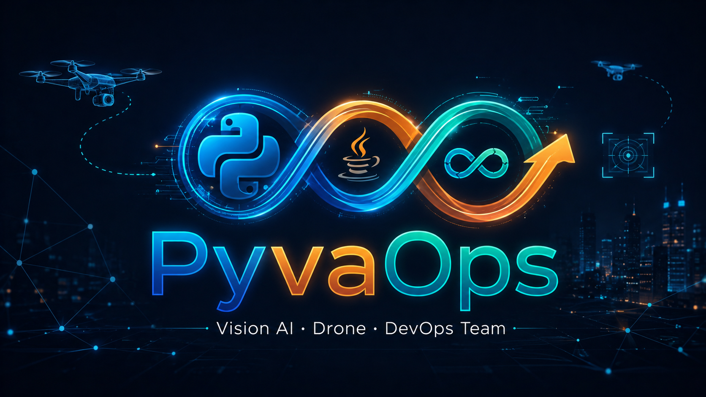
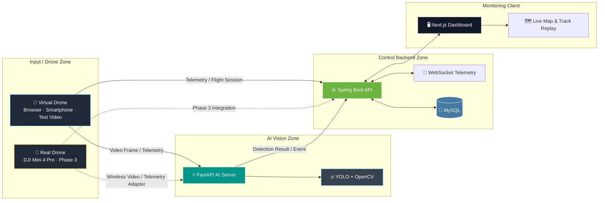
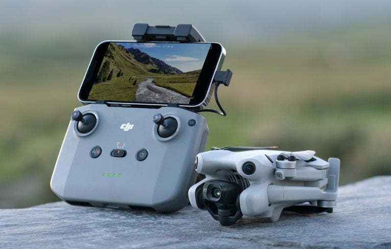

<!-- README conflict resolved for the Phase 2 closeout and Phase 3 preparation baseline. -->
<div align="center">

<!-- 저장소 루트에 PyvaOps_Logo.png 파일을 배치합니다. -->


</div>

<br>

<div align="left">

## 🎨 Team PyvaOps Logo Concept

팀명 **PyvaOps**는 **Py**thon(AI) + Ja**va**(Backend) + Dev**Ops**(Infra)를 결합한 이름입니다.<br>
서로 다른 기술 생태계를 하나의 실시간 파이프라인으로 연결하고, 설계부터 구현·검증·운영까지 직접 완성하는 **1인 올라운더(All-rounder) 프로젝트 팀**의 정체성을 담고 있습니다.

- **인피니티 루프**: AI, 백엔드, 인프라가 단절 없이 연결되는 데이터 흐름과 지속적인 개선을 상징합니다.
- **기술별 아이콘과 색상**: Python 기반 Vision AI, Java 기반 관제 백엔드, DevOps 기반 실행 환경의 결합을 표현합니다.
- **네온 네트워크 이미지**: 실시간 영상·텔레메트리·이벤트가 유기적으로 흐르는 지능형 관제 시스템을 시각화합니다.

</div>

---

<div align="center">

# 👁️ VisionFlow-Drone

## 무선 영상·텔레메트리 기반 지능형 드론 관제 및 Vision AI 표준 파이프라인

### 가상 드론 검증에서 실제 드론 관제로 성장하는 2차·3차 연계형 프로젝트

[](#)
[](#)
[](#)
[](Daily_Schedule/PHASE3_SCHEDULE.md)

</div>

<br>

## 🌐 Project Overview

**VisionFlow-Drone**은 드론 또는 가상 드론에서 수집한 영상과 텔레메트리를 AI 서버, 관제 백엔드, 웹 대시보드로 연결하는 **실시간 지능형 안전 관제 플랫폼**입니다.

프로젝트명은 다음 두 핵심 개념을 결합합니다.

- **Vision**: YOLO와 OpenCV 기반 영상 분석 및 객체 탐지
- **Flow**: 영상, 위치, 배터리, 탐지 이벤트, 이력 데이터가 실시간으로 흐르는 통합 파이프라인

2차 프로젝트에서는 **스마트폰·브라우저·더미 영상 기반 가상 드론**으로 전체 관제 파이프라인을 구현하고, 실제 스마트폰 센서·후면 카메라·YOLO 통합 E2E와 보안·CI/CD·자동 Rollback까지 검증했습니다.

3차 프로젝트(2026.08.18 ~ 2026.09.11)에서는 이 기준선을 유지하면서 **DJI Mini 4 Pro 실기체 연계**, 무선 영상 입력, Edge GPU Vision AI, 실제/준실제 텔레메트리 연결 및 현장형 관제 시연으로 확장합니다. AWS는 핵심 기능을 대체하지 않으며, **Go / No-Go 기술 타당성 Spike를 통과한 경우에만 Edge–Cloud 선택 확장**으로 적용합니다.

> **핵심 방향**<br>
> 특정 드론 기체나 단일 AI 모델에 종속되지 않고, 영상 입력원과 탐지 모델을 교체해도 재사용할 수 있는 **표준화된 Vision AI 관제 파이프라인**을 구축합니다.

---

## 📅 Phase 3 Work Schedule

> **3차 프로젝트 공식 기간: 2026.08.18 ~ 2026.09.11**
> 강사·멘토가 진행 상황을 바로 확인할 수 있도록 3차 프로젝트 상세 일정표를 별도 문서로 관리합니다.

### 👉 [3차 프로젝트 상세 작업 일정표 바로가기](Daily_Schedule/PHASE3_SCHEDULE.md)

핵심 우선순위는 다음과 같습니다.

1. **DJI Mini 4 Pro 실기체 영상 입력 경로 검증**
2. **AI 영상 추론 고도화 — YOLO26m Detection + Tracking + Pose + Segmentation + VisDrone 소형 객체 대응**
3. **Edge GPU 기반 실시간 Multi-Task 추론 성능 최적화**
4. **비행 세션·텔레메트리·AI Event·MySQL 통합**
5. **Next.js 관제 대시보드 End-to-End 시연**
6. **CI/CD·Health Check·Automatic Rollback 회귀 검증**
7. **AWS는 Time-boxed Go / No-Go 통과 시에만 선택 확장**

---

## 👀 Sneak Peek

> 시연 GIF와 대시보드 캡처 이미지는 기능 검증 완료 후 저장소의 `docs/images/` 경로에 추가할 예정입니다.

<div align="center">

<!-- 예:  -->

**실시간 드론 관제 대시보드 · 텔레메트리 경로 · AI 영상 분석 결과 시연 준비 중**

</div>

---

## 🧭 Project Scope

### 🏁 Phase 2 — 가상 드론 기반 통합 관제 파이프라인

- 브라우저 카메라, 스마트폰 센서, 더미 영상 기반 가상 드론 입력
- 드론 등록·수정·상태 변경·삭제 및 상세 정보 관리
- 위도·경도·고도·배터리·접속 시각 텔레메트리 수집
- WebSocket 기반 실시간 텔레메트리 전달
- MySQL 텔레메트리 이력 저장 및 과거 비행 경로 조회
- 실시간 경로와 과거 경로를 연결한 지도 시각화 및 리플레이
- FastAPI 기반 AI 영상 수집·추론 API
- Spring Boot, FastAPI, Next.js 간 통합 검증

### 🚀 Phase 3 — 실기체·Edge AI 기반 현장형 관제 고도화

- DJI Mini 4 Pro ↔ RC-N2 ↔ DJI Fly 실제 연결 및 Live View 검증
- DJI Fly가 실제 지원하는 Live Streaming/무선 출력 인터페이스 확인 후 영상 경로 확정
- 무선 영상 → Edge AI(FastAPI + YOLO/OpenCV) 수신·추론 파이프라인 구현
- 실제 또는 확보 가능한 비행 데이터 Adapter와 Flight Session·Telemetry 연계
- AI Event·Snapshot·Telemetry·비행 이력을 MySQL과 관제 화면에서 통합 추적
- **AI 영상 추론 고도화:** `yolo26m.pt` Detection + Tracking + `yolo26m-pose.pt` Pose + `yolo26m-seg.pt` Segmentation 단계형 통합, `best.pt` 퀄리티 개선, VisDrone 기반 원거리·소형 객체 대응
- 기존 HTTPS·RBAC·QR Pairing·CI/CD·Automatic Rollback의 3차 E2E 회귀 검증
- AWS는 4~6시간 Time-boxed Go / No-Go Spike 통과 시 Event/Telemetry 중심 Edge–Cloud 확장만 최소 적용
- 최종 발표·현장 시연을 위한 정상/대체 시나리오와 복구 Runbook 고정

> DJI Mini 4 Pro의 실제 영상·비행 데이터 연계 범위는 DJI Fly/RC-N2에서 확인되는 지원 인터페이스와 네트워크 환경을 기준으로 확정합니다. AWS GPU/EKS/SageMaker는 3차 핵심 성공 조건이 아닙니다.

---

## 🛠 Tech Stack

### 🌐 Frontend

   

### ☕ Backend

   

### 🤖 AI Vision Server

    

### 🗄 Database & Infrastructure

    

---

## 🛰️ System Architecture

VisionFlow-Drone은 UI, 관제 비즈니스 로직, AI 추론, 데이터 저장소를 분리한 **하이브리드 서비스 아키텍처**를 사용합니다.

- **Next.js**: 드론 목록, 상세 관제, 지도, 경로 리플레이, AI 스트림 UI
- **Spring Boot**: 드론·비행 세션·텔레메트리·이력 API와 실시간 이벤트 중계
- **FastAPI**: 영상 프레임 수집, YOLO/OpenCV 추론 및 분석 결과 생성
- **MySQL**: 드론 정보, 비행 세션, 텔레메트리 및 관제 이력 저장



점선으로 표시된 실제 드론 입력은 **3차 프로젝트 확장 범위**이며, 2차 프로젝트에서는 가상 드론과 시험 영상으로 통합 파이프라인을 검증했습니다.

---

## 🔁 Verified CI/CD Pipeline

VisionFlow-Drone은 소스 검증, 컨테이너 이미지 발행, 실제 배포, Health Check, 자동 Rollback을 분리한 CI/CD 구조를 사용합니다.

```mermaid
flowchart LR
    Source["Public Source Repo"] --> CI["GitHub Actions CI<br/>Contract · Security · Traceability"]
    CI --> Registry["Docker Hub<br/>Immutable SHA Images"]
    Registry --> Deploy["Private Deploy Control"]
    Deploy --> Runner["Windows Self-hosted Runner"]
    Runner --> Gate["Release Safety Gate"]
    Gate --> BackendCD["Backend Deploy"]
    BackendCD --> AICD["AI Deploy"]
    AICD --> FrontendCD["Frontend Deploy"]
    FrontendCD --> Health["HTTP / HTTPS Health Check"]
    Health --> Success["Deployment SUCCESS"]
    BackendCD -. failure .-> Rollback["Automatic Rollback"]
    AICD -. failure .-> Rollback
    FrontendCD -. failure .-> Rollback
    Health -. failure .-> Rollback
    Rollback --> Previous["Previous Immutable SHA"]
    Previous --> Recovery["Full Platform Health Check"]
```



### 검증 완료 항목

- API Contract · Security · System Traceability CI Gate
- Docker Hub Backend / AI / Frontend immutable SHA image publish
- Private 배포 제어 저장소와 Windows self-hosted runner
- Release SHA, clean workspace, Docker Hub image, ACTIVE flight, platform health Preflight
- Backend → AI → Frontend 순차 CD 재배포
- Backend / AI / Frontend / HTTPS Health Check
- 의도적 장애 주입 후 이전 immutable SHA로 Automatic Rollback
- Rollback 후 전체 플랫폼 Health Check 및 SHA 일관성 검증

검증된 기준 Release는 `a6f29c6`이며, 제어된 Rollback 검증에서는 `a191563`을 Target으로 사용한 뒤 `a6f29c6`으로 자동 복구했습니다.

자세한 공개 아키텍처·검증 범위는 [`docs/CI-CD-ARCHITECTURE.md`](docs/CI-CD-ARCHITECTURE.md)를 참고합니다.

---

## 🌊 Data Flow

1. **입력 수집**<br>
   브라우저 카메라, 스마트폰, 시험 영상 또는 향후 실제 드론에서 영상과 텔레메트리를 수집합니다.

2. **AI 분석**<br>
   FastAPI 서버가 영상 프레임을 수신하고 YOLO·OpenCV 기반 객체 탐지를 수행합니다.

3. **관제 데이터 처리**<br>
   Spring Boot 서버가 드론 상태, 비행 세션, 텔레메트리, AI 이벤트를 검증하고 저장합니다.

4. **실시간 전달**<br>
   WebSocket을 통해 최신 텔레메트리와 상태 변화를 관제 화면으로 전달합니다.

5. **이력 조회 및 재생**<br>
   MySQL에 저장된 과거 텔레메트리 경로를 조회하여 실시간 경로와 연결하고 지도에서 재생합니다.

6. **Phase 3 확장**<br>
   실제 드론용 영상·텔레메트리 어댑터를 추가해 기존 서비스 계층을 변경하지 않고 입력원을 확장합니다.

---

<div align="center">

<!-- 저장소 루트 또는 docs/images에 실제 보유 이미지 파일을 배치합니다. -->


<sub>▲ 3차 프로젝트 실제 드론 시연에 사용할 DJI Mini 4 Pro</sub>

</div>

---

## 🎯 Core Features

| 분류 | 기능 | 현재 상태 | 설명 |
|---|---|---:|---|
| 🚁 드론 관리 | Drone CRUD & Status Control | ✅ 구현 | 드론 등록, 목록, 상세 조회, 수정, 상태 변경, 삭제 |
| 📡 텔레메트리 | Real-time Telemetry | ✅ 구현 | 위도, 경도, 고도, 배터리, 최종 접속 시각 수집 및 갱신 |
| 🔄 실시간 통신 | WebSocket Publishing | ✅ 구현 | 개별 드론 및 함대 텔레메트리 실시간 전달 |
| 🗺️ 관제 지도 | Live Track & History Replay | ✅ 구현 | 실시간 위치, 과거 경로 조회, 연결 표시 및 리플레이 |
| 🗄️ 이력 관리 | Telemetry Persistence | ✅ 구현 | MySQL 기반 텔레메트리 이력 저장 및 경로 조회 API |
| 🎬 비행 세션 | Flight Session Management | ✅ 구현 | 가상 드론 촬영·비행 단위 세션 생성 및 상태 관리 |
| 🤖 AI 수집 | Frame Ingest API | ✅ 구현 | 브라우저·스마트폰·시험 영상 프레임을 FastAPI로 전달 |
| 🛡️ 안전 탐지 | Helmet / PPE Detection | 🟡 모델 고도화 중 | 작업자와 안전모·보호구 착용 여부 분석 |
| 🧍 위험 행동 | Human Pose Estimation | 🔵 Phase 3 확장 | 쓰러짐 등 위험 행동 탐지 로직 연구 및 적용 |
| 📶 실기체 연계 | DJI / Wireless Video Adapter | 🔵 Phase 3 확장 | DJI Mini 4 Pro 영상 및 비행 데이터 연계 검증 |
| 🔐 운영 보안 | HTTPS / RBAC / QR Pairing / Audit | ✅ 핵심 구현 | HTTPS, 역할 기반 인증·인가, 브라우저 세션, 보안 QR 페어링, 감사 로그 |

> 상태 표기: ✅ 구현 · 🟡 구현/검증 중 · 🔵 후속 확장

---

## 📂 Repository Structure

```text
VisionFlow-Drone/
├── 01_frontend/
│   └── visionflow-web/            # Next.js 관제 대시보드
├── 02_backend/
│   └── visionflow-api/            # Spring Boot 관제 API 및 WebSocket
├── 03_ai-server/
│   └── visionflow-ai/             # FastAPI 기반 영상 수집·AI 추론 서버
├── Daily_Schedule/                # 2차 프로젝트 작업 일정 및 기록
├── artifacts/                     # 모델, 결과물, 배포 산출물 관리
├── backups/                       # 전환·복구용 백업 자료
├── docs/                          # 아키텍처, API, 시연 및 운영 문서
├── infrastructure/                # Docker Compose, 네트워크, 배포 설정
├── scripts/                       # 실행, 점검, 이전 및 복구 자동화 스크립트
└── README.md
```

> 실제 디렉터리 구성은 개발 단계에 따라 확장될 수 있으며, 각 하위 프로젝트의 세부 실행 방법은 해당 디렉터리 문서를 따릅니다.

---

## 🚀 Quick Start

현재 공개 저장소의 로컬 개발 기본값은 **Docker Compose + CPU AI 프로필**입니다. 모바일 HTTPS 진입점은 Caddy 기반 별도 Compose 서비스로 관리합니다. 검증된 Release 배포는 Docker Hub immutable SHA 이미지와 Private CD 제어 저장소를 통해 수행합니다.

### 1) Clone

```bash
git clone https://github.com/automaster5013/VisionFlow-Drone.git
cd VisionFlow-Drone
```

### 2) 기본 서비스 실행

```bash
docker compose --env-file .env.docker up -d --wait
```

### 3) 모바일 HTTPS 진입점 실행

```bash
docker compose --env-file .env.docker -f compose.mobile-https.yaml up -d
```

> `visionflow-mobile-https`는 애플리케이션 Release Compose와 분리해 관리합니다. 운영 중 `--remove-orphans`를 사용하지 않습니다.

### 4) 서비스 상태 확인

```bash
docker compose --env-file .env.docker ps
docker ps --filter "name=visionflow-mobile-https"
```

| 서비스 | 주소 |
|---|---|
| Next.js 관제 화면 | `http://localhost:3000` |
| Spring Boot API | `http://localhost:8080` |
| FastAPI AI 서버 | `http://localhost:8000` |
| FastAPI API 문서 | `http://localhost:8000/docs` |
| 모바일 HTTPS 진입점 | `https://localhost:3443` |
| MySQL | `localhost:3307` |

### 5) 기본 운영 점검

```bat
scripts\run-visionflow-acceptance.bat
scripts\run-visionflow-storage-audit.bat
scripts\run-visionflow-backup.bat --consistent
```

운영·이관·정리 절차는 다음 문서를 참고합니다.

- [`docs/README-MIGRATION.md`](docs/README-MIGRATION.md)
- [`docs/README-backup-resume-fix.md`](docs/README-backup-resume-fix.md)
- [`docs/README-presentation-data-cleanup.md`](docs/README-presentation-data-cleanup.md)

> `.env`, DB 계정, 포트, 모델 가중치 경로 등은 공개 저장소에 비밀값을 올리지 않고 `.env.example`을 통해 관리합니다.

---

## 🗺️ Development Roadmap

### ✅ 완료 또는 핵심 구현 완료

- [x] 프로젝트 초기 아키텍처 및 모노레포 구조 설계
- [x] Docker 기반 MySQL 개발 환경 구성
- [x] 드론 관리 CRUD 및 상태 제어 API
- [x] Next.js 드론 목록·상세 관제 화면
- [x] 드론 텔레메트리 갱신 API
- [x] WebSocket 기반 실시간 텔레메트리 전달
- [x] 함대 단위 텔레메트리 관제
- [x] MySQL 텔레메트리 이력 저장
- [x] 과거 비행 경로 조회 API
- [x] 지도 기반 실시간·과거 경로 연결 및 리플레이
- [x] FastAPI 서버 기본 실행 및 프론트엔드 프록시 연동
- [x] PC 수동 모드 기반 가상 드론 통합 검증

### ✅ Phase 2 통합 검증 완료

- [x] 비행 세션 API와 가상 드론 촬영 흐름 안정화
- [x] 브라우저·스마트폰 영상 프레임 수집 흐름 고도화
- [x] 스마트폰 실센서 모드 HTTPS/인증서 환경 재검증
- [x] YOLO 기반 안전모·보호구 탐지 파이프라인 통합
- [x] 대시보드 오류 처리, 로딩 상태 및 운영 UI 개선
- [x] 전환·복구 스크립트와 다중 PC 개발 환경 표준화

### 🟡 Phase 2 후속 안정화

- [x] 발표·데모 데이터 선별 정리와 복원 가능한 격리 백업
- [x] GPU·모바일 HTTPS Compose 구성을 보존하는 일관성 백업
- [x] VIEWER/OPERATOR/ADMIN RBAC, 운영자 브라우저 세션, 보안 QR 페어링 검증
- [x] 스마트폰 HTTPS 실센서·후면 카메라·YOLO 통합 E2E 회귀 검증
- [ ] AI 탐지 바운딩박스·스냅숏 표시 회귀 검증

### 🚀 Phase 3 실행 계획 — 2026.08.18 ~ 2026.09.11

> 상세 일정 및 진행 상태: **[Phase 3 작업 일정표](Daily_Schedule/PHASE3_SCHEDULE.md)**

- [ ] DJI Mini 4 Pro / RC-N2 / DJI Fly 실제 영상 입력 경로 검증
- [ ] 무선 영상 수신 Adapter 또는 중계 경로 구현
- [ ] Edge GPU YOLO/OpenCV 실시간 추론 및 성능 기준선 확보
- [ ] 실제/준실제 비행 데이터와 Flight Session·Telemetry 연결
- [ ] AI Event·Snapshot·Telemetry·MySQL·관제 Dashboard 통합 E2E
- [ ] Helmet/PPE 정밀도 보완 및 Human Pose Estimation 선택 확장
- [x] 역할 기반 인증·인가, 세션, 보안 QR 페어링 및 감사 로그 강화
- [x] Caddy HTTPS 진입점 및 Docker Compose Release 배포 구성
- [x] GitHub Actions CI + Private CD + Docker Hub immutable SHA + 자동 Rollback 검증
- [ ] AWS Edge–Cloud Spike 최종 GO / NO-GO 판정 및 선택 확장
- [ ] 최종 발표용 실기체 통합 시연·복구 시나리오 완성

---

## 🔎 Engineering Principles

- **Separation of Concerns**: 영상 추론, 관제 로직, UI, 데이터 저장소를 분리합니다.
- **Replaceable Input**: 브라우저, 스마트폰, 시험 영상, 실제 드론 입력을 어댑터 방식으로 교체합니다.
- **Traceability**: 텔레메트리와 이벤트를 이력으로 저장해 재현성과 감사 가능성을 확보합니다.
- **Progressive Validation**: 가상 입력으로 안정성을 먼저 검증한 뒤 실제 드론으로 확장합니다.
- **Recovery First**: 개발 PC 전환, 백업, 복구, 실행 점검 절차를 코드와 문서로 관리합니다.
- **No Secret in Git**: 비밀번호, 토큰, 인증서, 개인키, 대용량 가중치는 Git 이력에 포함하지 않습니다.

---

## 👤 Developer

**이명휘 · Team PyvaOps**

- VisionFlow-Drone 아키텍처 및 데이터 파이프라인 설계
- Next.js 관제 대시보드 개발
- Spring Boot API·WebSocket·텔레메트리 이력 구현
- FastAPI·YOLO·OpenCV AI 서버 통합
- Docker 기반 개발 환경과 전환·복구 자동화 구성
- 2차 가상 드론 검증 및 3차 실제 드론 연계 기획

본 프로젝트는 지능형 공공·산업 안전 분야에서 재사용할 수 있는 **드론 기반 Vision AI 표준 관제 파이프라인**을 지향합니다.

---

## 📄 License & Notice

소스 코드 공개 범위와 라이선스는 최종 배포 전 확정할 예정입니다.<br>
외부 데이터셋, 모델 가중치, 이미지 및 제조사 SDK를 사용할 경우 각각의 라이선스와 이용 조건을 준수합니다.

---

<div align="center">

© 2026 Team PyvaOps. All rights reserved.

</div>
