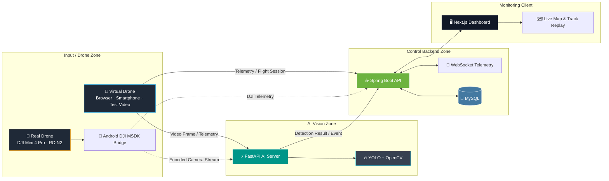

<!-- Last updated: 2026-09-12 KST. Status claims are limited to verified evidence. -->
<div align="center">

<!-- 저장소 루트에 PyvaOps_Logo.png 파일을 배치합니다. -->


</div>

<div align="center">

# 👁️ VisionFlow-Drone

## 무선 영상·텔레메트리 기반 지능형 드론 관제 및 Vision AI 표준 파이프라인

### 가상 드론 검증에서 실제 드론 관제로 성장하는 2차·3차 연계형 프로젝트

[](#)
[](#)
[](#)
[](Daily_Schedule/PHASE3_SCHEDULE.md)

</div>

<br>

## 🌐 Project Overview

**VisionFlow-Drone**은 드론 또는 가상 드론에서 수집한 영상과 텔레메트리를 AI 서버, 관제 백엔드, 웹 대시보드로 연결하는 **실시간 지능형 안전 관제 플랫폼**입니다.

프로젝트명은 다음 두 핵심 개념을 결합합니다.

- **Vision**: YOLO와 OpenCV 기반 영상 분석 및 객체 탐지
- **Flow**: 영상, 위치, 배터리, 탐지 이벤트, 이력 데이터가 실시간으로 흐르는 통합 파이프라인

2차 프로젝트에서는 **스마트폰·브라우저·더미 영상 기반 가상 드론**으로 전체 관제 파이프라인을 구현하고, 실제 스마트폰 센서·후면 카메라·YOLO 통합 E2E와 보안·CI/CD·자동 Rollback까지 검증했습니다.

3차 프로젝트(2026.08.19 ~ 2026.09.09)에서는 이 기준선을 유지하면서 **DJI Mini 4 Pro + RC-N2 + Android DJI MSDK Bridge 실기체 연계**, encoded camera stream, Edge GPU Vision AI, 실제/준실제 텔레메트리 연결 및 현장형 관제 시연으로 확장합니다. AWS는 AI 추론을 대체하지 않고, **로컬 Edge AI + AWS EC2 Frontend/Backend/MySQL** 하이브리드 배치로 확장해 SSH 터널 기반 서비스·이벤트 저장 경로를 검증했습니다.

> **핵심 방향**<br>
> 특정 드론 기체나 단일 AI 모델에 종속되지 않고, 영상 입력원과 탐지 모델을 교체해도 재사용할 수 있는 **표준화된 Vision AI 관제 파이프라인**을 구축합니다.

---

## 🚦 Phase 3 최종 상태 — 2026.09.12 KST

**최종 발표를 완료하고, 발표 산출물·공개 운영 서비스·배포 결과를 확인했습니다.** 발표용 통합 영상은 공개 웹 재생 경로로 연결했으며, 로컬·AWS 서비스의 재시작 후 복구도 검증했습니다.

- **통합 시연:** 준비된 영상의 실제 로컬 GPU 추론 + 가상 텔레메트리 → AWS 웹/API/MySQL → 세션 보고서 저장·재조회 확인.
- **시연 기록:** 09.09 짧은 세션에서 영상 프레임 수락 94회, 좌표 25개, AI 이벤트 4건. 서버에 기록된 13초 일시정지를 품질 진단의 수신 공백에서 구분했습니다. 처리·저장 건수이며 FPS나 탐지 정확도가 아닙니다.
- **운영 AI:** 기존 PPE 모델과 별도 사람 탐지 모델을 함께 사용합니다. person·hardhat·no-hardhat·vest를 표시하며, 사람 박스는 뒤에, 보호구는 앞에 표시하고 미착용 중앙 경고는 천천히 깜빡입니다.
- **원거리 후보:** VisDrone 검증 이미지 24장·입력 960의 작은 사람 Recall은 기존 COCO 26.5%, S1 46.3%였습니다. 하지만 건설현장 시연 표본에서는 S1의 사람 탐지가 감소해 운영 교체를 보류했습니다. 공식 전체 평가·PPE 정확도·운영 성능으로 일반화하지 않습니다.
- **데이터·학습:** 원본 PPE 데이터셋을 저장소 외부에서 확인했습니다. 현재 라벨의 person 부재와 라벨 의미·중복 검수 과제가 남아 있습니다. 반사띠가 있는 파란 작업복을 vest 정의에 포함했으나 추가 학습·정식 GT·모델 승격은 완료하지 않았습니다.
- **스마트폰 실센서:** 09.09 오전 카메라 없이 실제 위치·방향 센서를 송신하고 PC 관제에서 수신 시각과 방위각·피치·롤 갱신을 확인했습니다. 송신 중지 후 마지막 수신 시각은 사용자 확인 기준 09:32:36 KST입니다. [검증 기록](docs/smartphone-telemetry-20260909.md)
- **실기체:** DJI 소프트웨어 경로와 실장비 E2E는 구분합니다. 이번 오전 시험에는 카메라·실기체 비행·센서 정확도 교정·비행 세션 보고서 검증을 포함하지 않았습니다.
- **발표 산출물:** PPT 17장 검토, 설명 10분 분량 발표자 노트, VisionFlow → 별도 Drone-Eye DEMO 통합 MP4 제작·전체 디코딩 검사 및 최종 발표 완료.

자세한 결과·산출물 파일명·검증 범위는 [09.09 발표 준비 마감 기록](docs/presentation-closeout-20260909.md)을 참고하세요. **Drone-Eye는 별도 영상 분석 DEMO이며 VisionFlow 직접 연동이나 여섯 분석 모듈의 운영 적용을 뜻하지 않습니다.**

---

## 📅 Phase 3 Work Schedule

> **3차 프로젝트 공식 기간: 2026.08.19 ~ 2026.09.09**<br>
> **일정 변경:** 최종 발표일이 2026.09.11에서 **2026.09.09로 이틀 앞당겨져**, 09.07 Feature Freeze → 09.08 최종 리허설·산출물 고정 → 09.09 발표 순으로 일정을 압축했습니다.<br>
> 강사·멘토가 진행 상황을 바로 확인할 수 있도록 3차 프로젝트 상세 일정표를 별도 문서로 관리합니다.

### 👉 [3차 프로젝트 상세 작업 일정표 바로가기](Daily_Schedule/PHASE3_SCHEDULE.md)

발표 완료 후에도 재현 가능한 공개 확인 경로는 다음과 같습니다.

1. **완료:** 더미영상·가상 텔레메트리 세션과 보고서 기록 검증
2. **완료:** PPT 최종본 17장 검토 및 10분 발표자 노트 입력 프롬프트 작성
3. **완료:** 약 3분 56초의 통합 제출 MP4 제작·검사
4. **완료:** Gamma 노트·시간 측정 리허설·최종 제출·발표
5. **완료:** 09.09 오전 스마트폰 실센서 송신 및 PC 방향값 갱신 확인
6. **후속:** 원거리/PPE 데이터 검수·추가 학습 및 실기체·카메라 통합 장시간 검증

### 🎬 발표 시연 확인 링크

- [공개 운영 대시보드](https://visionflow-drone.cloud/dashboard)
- [발표 통합 리플레이 화면](https://visionflow-drone.cloud/presentation-replay) — 운영자 로그인 필요
- [발표용 더미 영상 직접 재생](https://visionflow-drone.cloud/demo/presentation-dummy.mp4)
- [최종 발표·검증 기록](docs/presentation-closeout-20260909.md)

> 대용량 최종 MP4는 저장소에 직접 커밋하지 않았습니다. 공개 웹의 영상과 리플레이 화면을 통해 시연 흐름을 확인할 수 있으며, Drone-Eye DEMO는 VisionFlow 운영 기능과 구분합니다.

### ✅ 선행 검증 기록 (09.07까지의 기준선)

아래는 이전 단계의 검증 기록입니다. 09.09 현장 재시험이나 현재 실행 상태를 뜻하지 않습니다.

- **보안·모바일:** 개인 로그인, DB 귀속 RBAC, 자동 임시 비밀번호·최초 변경 강제, HttpOnly 세션, QR Pairing, 모바일 HTTPS와 실제 기기 주소 재탐지 검증
- **서비스·배포:** Frontend/Backend/AI/MySQL/Caddy 5-service health, immutable image CI/CD, 순차 배포, Health Check와 Automatic Rollback 검증
- **AWS Hybrid:** Local AI의 통제 Event를 AWS Backend/MySQL에 저장하고 AWS Frontend에서 조회하는 최소 E2E PASS
- **DJI 소프트웨어 경로:** Android Bridge listener·uploader와 Edge AI 수신/FFmpeg decode 경로 구현 및 Debug APK 빌드 PASS. 실장비 runtime은 계속 별도 Gate
- **VisDrone S1:** 10-class 항공 시점 Detection 학습 완료, 재현 가능한 canonical initializer 고정
- **PPE Batch 0001:** curated pool 512 비파괴 감사, focus 38(재주석 34·격리 HOLD 4), 34건 AI-assisted proposal과 S2 smoke 입력 패키지 준비 완료

---

## 👀 Demo & Sneak Peek

> 최종 발표가 완료되어 공개 운영 화면과 발표용 영상 링크를 제공합니다.

<div align="center">

👉 **[라이브 대시보드 열기](https://visionflow-drone.cloud/dashboard)** · **[발표용 영상 재생](https://visionflow-drone.cloud/demo/presentation-dummy.mp4)**

**발표 MP4 제작 완료 · 일부 관제 구간은 화면 캡처 편집, AI 구간은 추론 영상 · 별도 Drone-Eye DEMO 포함**

</div>

---

## 🧭 Project Scope

### 🏁 Phase 2 — 가상 드론 기반 통합 관제 파이프라인

- 브라우저 카메라, 스마트폰 센서, 더미 영상 기반 가상 드론 입력
- 드론 등록·수정·상태 변경·삭제 및 상세 정보 관리
- 위도·경도·고도·배터리·접속 시각 텔레메트리 수집
- WebSocket 기반 실시간 텔레메트리 전달
- MySQL 텔레메트리 이력 저장 및 과거 비행 경로 조회
- 실시간 경로와 과거 경로를 연결한 지도 시각화 및 리플레이
- FastAPI 기반 AI 영상 수집·추론 API
- Spring Boot, FastAPI, Next.js 간 통합 검증

### 🚀 Phase 3 — 실기체·Edge AI 기반 현장형 관제 고도화

- DJI Mini 4 Pro ↔ RC-N2 ↔ Android DJI MSDK Bridge 실제 장치 연결 검증
- `ICameraStreamManager` 기반 camera availability 및 encoded stream packet 수신 경로 검증
- Android Bridge encoded stream → Edge AI(FastAPI + YOLO/OpenCV) 수신·추론 파이프라인 구현
- DJI FlightController/Product/RemoteController Key 기반 텔레메트리 Adapter와 Flight Session 연계
- AI Event·Snapshot·Telemetry·비행 이력을 MySQL과 관제 화면에서 통합 추적
- **AI 영상 추론 고도화:** Detection 중심의 VisDrone S1 baseline과 PPE S2 fast-track을 우선 검증하고, Tracking·Pose·Segmentation은 발표 후 선택 확장
- 기존 HTTPS·RBAC·QR Pairing·CI/CD·Automatic Rollback의 3차 E2E 회귀 검증
- AWS Edge–Cloud Spike는 GO로 판정했으며, 로컬 AI의 통제 Phase 3 Event를 AWS Backend·MySQL에 저장하고 AWS Frontend에서 조회하는 최소 Hybrid E2E를 검증
- 최종 발표·현장 시연을 위한 정상/대체 시나리오와 복구 Runbook 고정

> DJI Mini 4 Pro의 실제 영상·비행 데이터 연계 범위는 RC-N2 + Android DJI MSDK에서 확인되는 camera stream·key-value interface와 네트워크 환경을 기준으로 확정합니다. AWS GPU/EKS/SageMaker는 3차 핵심 성공 조건이 아닙니다.

---

## ☁️ Validated AWS Hybrid Deployment — 2026.08.31

AI 추론은 로컬 PC에 유지하고, AWS EC2에는 Frontend·Backend·MySQL을 배치한 하이브리드 서비스 경로를 통제 검증했습니다.

| 영역 | 검증된 배치·역할 |
|---|---|
| 로컬 PC | FastAPI AI 서버, 영상 스트림, AI Event 생성 |
| AWS EC2 | Next.js Frontend + Spring Boot Backend + MySQL |
| 연결 | Frontend와 Backend를 loopback에 바인딩하고 SSH 터널로 접근 |
| 운영 | Elastic IP와 EBS를 유지하고 미사용 시 EC2를 정상 중지 |

- Frontend → Backend → MySQL `/api/drones` HTTP 200 및 JSON 응답 확인
- 로컬 AI 컨테이너 → AWS Phase 3 Event HTTP 201 확인
- AWS MySQL에 발표 증거 Event 정확히 1행 저장 및 AWS Frontend 표시 확인
- Frontend 3000과 MySQL 3306을 Security Group에 공개하지 않는 접근 경계 유지
- 최종 presentation readiness에서 Frontend·Backend·AI health와 DB 증거를 읽기 전용으로 재검증

> 이 검증은 하이브리드 서비스와 Event 전달 경로의 Evidence입니다. DJI 실기체 영상 입력이나 DJI stream 기반 Edge GPU 실시간 추론 완료를 의미하지 않으며, 해당 범위는 별도 Gate입니다.

---

## 🧠 AI 학습·데이터 현황

### Stage 1 — VisDrone 소형 객체 대응

- VisDrone 10-class S1 학습은 epoch 88에서 early stopping으로 완료했습니다.
- Canonical initializer는 `yolo26m-visdrone-s1-best.pt`이며, 파일 크기 `44,121,433 bytes`, SHA-256 `486f29a14b68201defb2148db923633f15b68f0304b50ff1f66b893ea4e16422`로 고정했습니다.
- 평가 계약·활성화 경계와 재현 정보는 [`yolo26m-visdrone-s1-best.manifest.json`](03_ai-server/visionflow-ai/models/manifests/yolo26m-visdrone-s1-best.manifest.json)에 기록하며, S1 지표를 PPE 정확도나 production safety certification으로 해석하지 않습니다.
- 대용량 weight 자체는 Git에 포함하지 않으며, S1은 다시 학습하지 않고 PPE S2의 초기화 모델로만 사용합니다.

### Stage 2 — PPE 4-class fast-track

목표 taxonomy는 `helmet / vest / head / person`입니다. 발표 일정 때문에 재주석 대상 34건의 완전 수동 입력은 발표 후로 이연하고, 현재는 **AI-assisted provisional proposal + 기술 smoke** 경로만 준비합니다.

| 단계 | 확인된 결과 | 상태 |
|---|---:|:---:|
| Curated annotation pool | 512건 provenance·exact/near-duplicate audit PASS | ✅ |
| Batch 0001 disposition | 64건 중 유효 focus 38건(재주석 34, 격리 HOLD 4) | ✅ |
| Anti-leakage 검토 | 기존 MNS 4개와 조건부 확장 1건, exact-payload 제약 2건을 Evidence로 고정 | ✅ 조건부 제약 |
| AI-assisted proposal | 재주석 대상 이미지 34/34 처리 PASS | 🧪 제안 전용 |
| PPE S2 smoke 입력 | 9장·87 provisional boxes(train 7, val 2) 조립 검증 PASS | 🧪 기술 입력 |
| PPE S2 1-epoch GPU smoke | 아직 실행하지 않음 | 🟡 실행 대기 |
| Final source-group / split | 최종 배정 0 | ⏸️ HOLD |
| Semantic / box Ground Truth | 승인 0 | ⏸️ HOLD |
| PPE S2 본 학습·canonical 승격 | 실행 0 | ⏸️ HOLD |

> Candidate edge는 자동 source-group으로 승격하지 않습니다. Must-not-split와 exact-payload 제약은 데이터 누출 방지용 조건이며, 보존본·라벨·포함 여부 또는 Ground Truth 승인을 대신하지 않습니다.

---

## 🛠 Tech Stack

### 🌐 Frontend

   

### ☕ Backend

   

### 🤖 AI Vision Server

    

### 🗄 Database & Infrastructure

    

---

## 🛰️ System Architecture

VisionFlow-Drone은 UI, 관제 비즈니스 로직, AI 추론, 데이터 저장소를 분리한 **하이브리드 서비스 아키텍처**를 사용합니다.

- **Next.js**: 드론 목록, 상세 관제, 지도, 경로 리플레이, AI 스트림 UI
- **Spring Boot**: 드론·비행 세션·텔레메트리·이력 API와 실시간 이벤트 중계
- **FastAPI**: 영상 프레임 수집, YOLO/OpenCV 추론 및 분석 결과 생성
- **MySQL**: 드론 정보, 비행 세션, 텔레메트리 및 관제 이력 저장



점선으로 표시된 실제 드론 입력은 **3차 프로젝트 확장 범위**이며, 2차 프로젝트에서는 가상 드론과 시험 영상으로 통합 파이프라인을 검증했습니다.

---

## 🔁 Verified CI/CD Pipeline

VisionFlow-Drone은 소스 검증, 컨테이너 이미지 발행, 실제 배포, Health Check, 자동 Rollback을 분리한 CI/CD 구조를 사용합니다.

```mermaid
flowchart LR
    Source["Public Source Repo"] --> CI["GitHub Actions CI<br/>Contract · Security · Traceability"]
    CI --> Registry["Docker Hub<br/>Immutable SHA Images"]
    Registry --> Deploy["Private Deploy Control"]
    Deploy --> Runner["Windows Self-hosted Runner"]
    Runner --> Gate["Release Safety Gate"]
    Gate --> BackendCD["Backend Deploy"]
    BackendCD --> AICD["AI Deploy"]
    AICD --> FrontendCD["Frontend Deploy"]
    FrontendCD --> Health["HTTP / HTTPS Health Check"]
    Health --> Success["Deployment SUCCESS"]
    BackendCD -. failure .-> Rollback["Automatic Rollback"]
    AICD -. failure .-> Rollback
    FrontendCD -. failure .-> Rollback
    Health -. failure .-> Rollback
    Rollback --> Previous["Previous Immutable SHA"]
    Previous --> Recovery["Full Platform Health Check"]
```



### 검증 완료 항목

- API Contract · Security · System Traceability CI Gate
- Docker Hub Backend / AI / Frontend immutable SHA image publish
- Private 배포 제어 저장소와 Windows self-hosted runner
- Release SHA, clean workspace, Docker Hub image, ACTIVE flight, platform health Preflight
- Backend → AI → Frontend 순차 CD 재배포
- Backend / AI / Frontend / HTTPS Health Check
- 의도적 장애 주입 후 이전 immutable SHA로 Automatic Rollback
- Rollback 후 전체 플랫폼 Health Check 및 SHA 일관성 검증

검증된 기준 Release는 `a6f29c6`이며, 제어된 Rollback 검증에서는 `a191563`을 Target으로 사용한 뒤 `a6f29c6`으로 자동 복구했습니다.

자세한 공개 아키텍처·검증 범위는 [`docs/CI-CD-ARCHITECTURE.md`](docs/CI-CD-ARCHITECTURE.md)를 참고합니다.

---

## 🌊 Data Flow

1. **입력 수집**<br>
   브라우저 카메라, 스마트폰, 시험 영상 또는 향후 실제 드론에서 영상과 텔레메트리를 수집합니다.

2. **AI 분석**<br>
   FastAPI 서버가 영상 프레임을 수신하고 YOLO·OpenCV 기반 객체 탐지를 수행합니다.

3. **관제 데이터 처리**<br>
   Spring Boot 서버가 드론 상태, 비행 세션, 텔레메트리, AI 이벤트를 검증하고 저장합니다.

4. **실시간 전달**<br>
   WebSocket을 통해 최신 텔레메트리와 상태 변화를 관제 화면으로 전달합니다.

5. **이력 조회 및 재생**<br>
   MySQL에 저장된 과거 텔레메트리 경로를 조회하여 실시간 경로와 연결하고 지도에서 재생합니다.

6. **Phase 3 확장**<br>
   실제 드론용 영상·텔레메트리 어댑터를 추가해 기존 서비스 계층을 변경하지 않고 입력원을 확장합니다.

---

<div align="center">

<!-- 저장소 루트 또는 docs/images에 실제 보유 이미지 파일을 배치합니다. -->


<sub>▲ 3차 프로젝트 실제 드론 시연에 사용할 DJI Mini 4 Pro</sub>

</div>

---

## 🎯 Core Features

| 분류 | 기능 | 현재 상태 | 설명 |
|---|---|---:|---|
| 🚁 드론 관리 | Drone CRUD & Status Control | ✅ 구현 | 드론 등록, 목록, 상세 조회, 수정, 상태 변경, 삭제 |
| 📡 텔레메트리 | Real-time Telemetry | ✅ 구현 | 위도, 경도, 고도, 배터리, 최종 접속 시각 수집 및 갱신 |
| 🔄 실시간 통신 | WebSocket Publishing | ✅ 구현 | 개별 드론 및 함대 텔레메트리 실시간 전달 |
| 🗺️ 관제 지도 | Live Track & History Replay | ✅ 구현 | 실시간 위치, 과거 경로 조회, 연결 표시 및 리플레이 |
| 🗄️ 이력 관리 | Telemetry Persistence | ✅ 구현 | MySQL 기반 텔레메트리 이력 저장 및 경로 조회 API |
| 🎬 비행 세션 | Flight Session Management | ✅ 구현 | 가상 드론 촬영·비행 단위 세션 생성 및 상태 관리 |
| 🤖 AI 수집 | Frame Ingest API | ✅ 구현 | 브라우저·스마트폰·시험 영상 프레임을 FastAPI로 전달 |
| 🔭 소형 객체 | VisDrone S1 Detection | ✅ 학습·검증 완료 | SHA-pinned canonical initializer와 발표용 controlled fallback 고정 |
| 🛡️ 안전 탐지 | Helmet / PPE 4-class | 🟡 provisional smoke 준비 | 34건 AI proposal·9장 smoke 입력 준비 완료, final GT·split·본 학습 HOLD |
| 🧍 위험 행동 | Human Pose Estimation | 🔵 발표 후 선택 확장 | 현재 발표 필수 범위에서 제외 |
| 📶 실기체 연계 | Android DJI MSDK Bridge | 🟡 소프트웨어 구현·실장비 대기 | Debug APK와 encoded stream 송수신 코드 PASS, ADB/Product/실제 stream·telemetry runtime 미검증 |
| ☁️ 하이브리드 배포 | Local AI + AWS Frontend/Backend/MySQL | ✅ 최소 E2E 검증 | SSH 터널 기반 서비스, Phase 3 Event 저장, MySQL 1행 및 Frontend 표시 확인 |
| 🔐 운영 보안 | Account Login / RBAC / Session / QR Pairing / Audit | ✅ 3차 선행 개선 | 개인 계정 로그인, 서버 Role 자동 적용, 초기 비밀번호 자동 생성·최초 변경 강제, HttpOnly 세션, 모바일 QR 페어링, 감사 로그 |

> 상태 표기: ✅ 실행·검증 완료 · 🟡 준비/부분 완료 · 🧪 실험/잠정 · ⏸️ HOLD · 🔵 발표 후 확장

---

## 📂 Repository Structure

```text
VisionFlow-Drone/
├── 01_frontend/
│   └── visionflow-web/            # Next.js 관제 대시보드
├── 02_backend/
│   └── visionflow-api/            # Spring Boot 관제 API 및 WebSocket
├── 03_ai-server/
│   └── visionflow-ai/             # FastAPI 기반 영상 수집·AI 추론 서버
├── 04_android/
│   └── visionflow-dji-bridge/     # DJI MSDK Android Bridge
├── Daily_Schedule/                # 2차 기록 및 3차 상세 작업 일정
├── artifacts/                     # 모델, 결과물, 배포 산출물 관리
├── backups/                       # 전환·복구용 백업 자료
├── docs/                          # 아키텍처, API, 시연 및 운영 문서
├── infrastructure/                # Docker Compose, 네트워크, 배포 설정
├── scripts/                       # 실행, 점검, 이전 및 복구 자동화 스크립트
└── README.md
```

> 실제 디렉터리 구성은 개발 단계에 따라 확장될 수 있으며, 각 하위 프로젝트의 세부 실행 방법은 해당 디렉터리 문서를 따릅니다.

---

## 🚀 Quick Start

현재 공개 저장소의 로컬 개발 기본값은 **Docker Compose + CPU AI 프로필**입니다. 모바일 HTTPS 진입점은 Caddy 기반 별도 Compose 서비스로 관리합니다. 검증된 Release 배포는 Docker Hub immutable SHA 이미지와 Private CD 제어 저장소를 통해 수행합니다.

### 1) Clone

```bash
git clone https://github.com/automaster5013/VisionFlow-Drone.git
cd VisionFlow-Drone
```

### 2) 기본 서비스 실행

```bash
docker compose --env-file .env.docker up -d --wait
```

### 3) 모바일 HTTPS 진입점 실행

```bash
docker compose --env-file .env.docker -f compose.mobile-https.yaml up -d
```

> `visionflow-mobile-https`는 애플리케이션 Release Compose와 분리해 관리합니다. 운영 중 `--remove-orphans`를 사용하지 않습니다.

### 4) 서비스 상태 확인

```bash
docker compose --env-file .env.docker ps
docker ps --filter "name=visionflow-mobile-https"
```

| 서비스 | 주소 |
|---|---|
| Next.js 관제 화면 | `http://localhost:3000` |
| Spring Boot API | `http://localhost:8080` |
| FastAPI AI 서버 | `http://localhost:8000` |
| FastAPI API 문서 | `http://localhost:8000/docs` |
| 모바일 HTTPS 진입점 | `https://localhost:3443` |
| MySQL | `localhost:3307` |

### 5) 기본 운영 점검

```bat
scripts\run-visionflow-acceptance.bat
scripts\run-visionflow-storage-audit.bat
scripts\run-visionflow-backup.bat --consistent
```

운영·이관·정리 절차는 다음 문서를 참고합니다.

- [`docs/README-MIGRATION.md`](docs/README-MIGRATION.md)
- [`docs/README-backup-resume-fix.md`](docs/README-backup-resume-fix.md)
- [`docs/README-presentation-data-cleanup.md`](docs/README-presentation-data-cleanup.md)

> `.env`, DB 계정, 포트, 모델 가중치 경로 등은 공개 저장소에 비밀값을 올리지 않고 `.env.example`을 통해 관리합니다.

---

## 🗺️ Development Roadmap

### ✅ 완료 또는 핵심 구현 완료

- [x] 프로젝트 초기 아키텍처 및 모노레포 구조 설계
- [x] Docker 기반 MySQL 개발 환경 구성
- [x] 드론 관리 CRUD 및 상태 제어 API
- [x] Next.js 드론 목록·상세 관제 화면
- [x] 드론 텔레메트리 갱신 API
- [x] WebSocket 기반 실시간 텔레메트리 전달
- [x] 함대 단위 텔레메트리 관제
- [x] MySQL 텔레메트리 이력 저장
- [x] 과거 비행 경로 조회 API
- [x] 지도 기반 실시간·과거 경로 연결 및 리플레이
- [x] FastAPI 서버 기본 실행 및 프론트엔드 프록시 연동
- [x] PC 수동 모드 기반 가상 드론 통합 검증

### ✅ Phase 2 통합 검증 완료

- [x] 비행 세션 API와 가상 드론 촬영 흐름 안정화
- [x] 브라우저·스마트폰 영상 프레임 수집 흐름 고도화
- [x] 스마트폰 실센서 모드 HTTPS/인증서 환경 재검증
- [x] YOLO 기반 안전 탐지 API·화면 연결 기준선 통합(모델 품질 개선은 Phase 3에서 별도 관리)
- [x] 대시보드 오류 처리, 로딩 상태 및 운영 UI 개선
- [x] 전환·복구 스크립트와 다중 PC 개발 환경 표준화

### 🟡 Phase 2 후속 안정화

- [x] 발표·데모 데이터 선별 정리와 복원 가능한 격리 백업
- [x] GPU·모바일 HTTPS Compose 구성을 보존하는 일관성 백업
- [x] VIEWER/OPERATOR/ADMIN RBAC, 운영자 브라우저 세션, 보안 QR 페어링 검증
- [x] 스마트폰 HTTPS 실센서·후면 카메라·YOLO 통합 E2E 회귀 검증
- [ ] AI 탐지 바운딩박스·스냅숏 표시 회귀 검증

### 🚀 Phase 3 실행 계획 — 2026.08.19 ~ 2026.09.09

> 상세 일정 및 진행 상태: **[Phase 3 작업 일정표](Daily_Schedule/PHASE3_SCHEDULE.md)**

- [x] DJI MSDK Android Bridge camera stream listener 컴파일 및 Debug APK 빌드
- [ ] ADB 실장비 연결 → MSDK 등록/Product 연결 → camera availability/encoded stream 검증
- [x] MSDK encoded stream 수신 Adapter와 Edge AI FFmpeg decode 입력 경로 구현
- [x] VisDrone S1 10-class 학습 완료 및 canonical weight 고정
- [x] PPE curated pool 512 provenance/duplicate audit와 Batch 0001 focus 38 확정
- [x] 재주석 대상 34건 AI-assisted provisional proposal 생성
- [x] PPE S2 1-epoch 기술 smoke 입력 9장·87 provisional boxes 조립 검증
- [ ] PPE S2 1-epoch GPU smoke 실행·로그·weight Evidence 고정
- [ ] 재주석 34건 완전 수동 보정과 semantic/box GT 승인(발표 후)
- [ ] Final source-group·split·PPE S2 본 학습·canonical 승격(`HOLD`)
- [ ] 실제/준실제 비행 데이터와 Flight Session·Telemetry 연결
- [ ] AI Event·Snapshot·Telemetry·MySQL·관제 Dashboard 통합 E2E
- [ ] Human Pose Estimation·Tracking·Segmentation 선택 확장(발표 후)
- [x] 개인 계정 로그인, DB Role 기반 RBAC, 자동 초기 비밀번호·최초 변경 강제, HttpOnly 세션, 보안 QR 페어링 및 감사 로그 강화
- [x] Caddy HTTPS 진입점 및 Docker Compose Release 배포 구성
- [x] GitHub Actions CI + Private CD + Docker Hub immutable SHA + 자동 Rollback 검증
- [x] AWS Edge–Cloud Spike GO 판정 및 Local AI → AWS Backend/MySQL → Frontend 최소 Hybrid E2E 검증
- [ ] 최종 발표용 실기체 통합 시연·복구 시나리오 완성

---

## 🔎 Engineering Principles

- **Separation of Concerns**: 영상 추론, 관제 로직, UI, 데이터 저장소를 분리합니다.
- **Replaceable Input**: 브라우저, 스마트폰, 시험 영상, 실제 드론 입력을 어댑터 방식으로 교체합니다.
- **Traceability**: 텔레메트리와 이벤트를 이력으로 저장해 재현성과 감사 가능성을 확보합니다.
- **Progressive Validation**: 가상 입력으로 안정성을 먼저 검증한 뒤 실제 드론으로 확장합니다.
- **Recovery First**: 개발 PC 전환, 백업, 복구, 실행 점검 절차를 코드와 문서로 관리합니다.
- **No Secret in Git**: 비밀번호, 토큰, 인증서, 개인키, 대용량 가중치는 Git 이력에 포함하지 않습니다.

---

## 👤 Developer

**이명휘 · Team PyvaOps**

**PyvaOps**는 **Py**thon(AI) + Ja**va**(Backend) + Dev**Ops**(Infra)를 결합한 이름입니다. 인피니티 루프 로고는 영상·텔레메트리·이벤트가 AI, 백엔드, 인프라 사이를 끊김 없이 흐르는 구조와 지속적인 개선을 상징합니다.

- VisionFlow-Drone 아키텍처 및 데이터 파이프라인 설계
- Next.js 관제 대시보드 개발
- Spring Boot API·WebSocket·텔레메트리 이력 구현
- FastAPI·YOLO·OpenCV AI 서버 통합
- Docker 기반 개발 환경과 전환·복구 자동화 구성
- 2차 가상 드론 검증 및 3차 실제 드론 연계 기획

본 프로젝트는 지능형 공공·산업 안전 분야에서 재사용할 수 있는 **드론 기반 Vision AI 표준 관제 파이프라인**을 지향합니다.

---

## 📄 License & Notice

소스 코드 공개 범위와 라이선스는 최종 배포 전 확정할 예정입니다.<br>
외부 데이터셋, 모델 가중치, 이미지 및 제조사 SDK를 사용할 경우 각각의 라이선스와 이용 조건을 준수합니다.

---

<div align="center">

© 2026 Team PyvaOps. All rights reserved.

</div>
