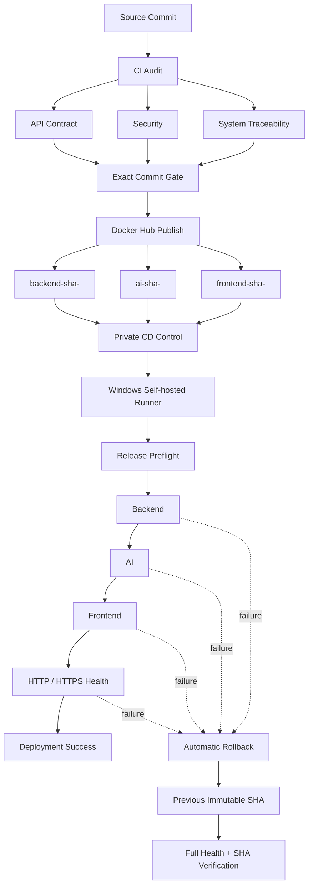

# VisionFlow-Drone CI/CD Architecture

## 1. 목적

이 문서는 VisionFlow-Drone의 공개 가능한 CI/CD 아키텍처와 실제 검증 범위를 설명합니다.

애플리케이션 소스와 배포 제어를 분리하여, 공개 소스 저장소에는 코드·품질 Gate·Docker 이미지 발행 정의를 두고 실제 배포 오케스트레이션은 Private 배포 제어 영역에서 수행합니다.

## 2. End-to-End Pipeline



## 3. CI Gate

Docker Hub publish는 임의의 소스를 바로 빌드하지 않습니다. Publish workflow가 실행된 정확한 source commit에 대해 API audit push run이 성공했는지 확인한 뒤에만 이미지를 발행합니다.

현재 CI Gate의 핵심 검증 범위:

- API contract drift
- API security policy
- source-derived AI OpenAPI inventory
- system traceability
- CI audit policy enforcement
- audit report artifact

## 4. Immutable Container Release

Backend, AI, Frontend는 동일한 7자리 source SHA를 공유하는 immutable tag 세트로 관리합니다.

예:

```text
automaster5013/visionflow-drone:backend-sha-a6f29c6
automaster5013/visionflow-drone:ai-sha-a6f29c6
automaster5013/visionflow-drone:frontend-sha-a6f29c6
```

`compose.release.yaml`은 애플리케이션 서비스의 local `build` 정의를 제거하고 Registry image만 사용하도록 구성합니다.

MySQL은 애플리케이션 Release 이미지 교체 대상에서 제외합니다.

## 5. Release Safety Gate

실제 배포 전에 다음 조건을 검사합니다.

1. Release SHA 형식 검증
2. `C:\VisionFlow-Drone`의 `main` branch 확인
3. clean working tree 확인
4. `compose.yaml + compose.release.yaml` 유효성 확인
5. Target Docker Hub image 3종 존재 확인
6. ACTIVE flight session이 `0`인지 확인
7. 현재 MySQL / Backend / AI / Frontend / Mobile HTTPS Health 확인
8. 현재 실행 중인 Backend / AI / Frontend가 하나의 immutable SHA 세트를 사용하는지 확인
9. Rollback 대상인 이전 Release 이미지가 로컬에 존재하는지 확인

Gate가 하나라도 실패하면 실제 컨테이너 교체 전에 배포를 차단합니다.

## 6. Deployment Order

애플리케이션 Release는 다음 순서로 배포합니다.

```text
Backend
  ↓ healthy + HTTP 200
AI
  ↓ healthy + HTTP 200
Frontend
  ↓ healthy + HTTP 200
Final Platform Health
```

최종 검증:

```text
Backend actuator health   200
AI /health                200
Frontend /dashboard       200
HTTPS /healthz            200
HTTPS /dashboard          200
```

`visionflow-mobile-https`는 Caddy 기반 별도 서비스로 유지하며 Release 과정에서 제거하지 않습니다.

## 7. Automatic Rollback

배포가 시작된 이후 Backend, AI, Frontend 또는 최종 Health Check에서 실패하면 배포 직전에 기록한 이전 immutable SHA로 자동 복구합니다.

Rollback 완료 조건:

- Backend 이전 SHA 복구 + healthy
- AI 이전 SHA 복구 + healthy
- Frontend 이전 SHA 복구 + healthy
- 전체 HTTP / HTTPS Health Check 통과
- 세 애플리케이션의 최종 SHA가 모두 이전 Release와 일치

## 8. 실제 검증 기준선

### Known-Good Release

```text
a6f29c6
```

### Controlled Rollback Test Target

```text
a191563
```

검증 시나리오:

```text
현재 a6f29c6
  → a191563 Backend 배포
  → Backend healthy / HTTP 200
  → Controlled Failure Injection
  → Automatic Rollback
  → a6f29c6 복구
  → 전체 Health Check PASS
  → 최종 SHA a6f29c6 확인
```

검증 결과:

```text
NO-OP CD validation          PASS
Real sequential CD deploy    PASS
Controlled failure injection PASS
Automatic rollback           PASS
Post-rollback health         PASS
```

## 9. Security Boundary

- 공개 Source Repository와 Private Deploy Control을 분리합니다.
- Docker Hub 배포 인증은 전용 Read-only PAT를 사용합니다.
- `.env.docker`, DB 계정, 운영자 Key, 인증서 Private Key, PAT는 Git에 저장하지 않습니다.
- 배포 Workflow는 임시 Docker credential 영역을 사용하고 Job 종료 시 정리합니다.
- Public repository에 Self-hosted Runner 배포 권한을 직접 연결하지 않습니다.

## 10. 현재 운영상 제한

- Backend 운영자 세션은 메모리 기반이므로 Backend 재배포 후 재로그인이 필요할 수 있습니다.
- AI runtime은 현재 배포 PC의 host-mounted 모델·데이터 디렉터리를 사용하므로 Registry AI image만으로 완전한 신규 호스트 이관이 되지는 않습니다.
- Windows self-hosted runner는 현재 재부팅 후 `run.cmd`로 수동 기동합니다.
- Docker Desktop이 실행 중이어야 CD job을 처리할 수 있습니다.
- 현재 배포 대상은 별도 Production Server가 아니라 프로젝트 시연/개발 PC입니다.
