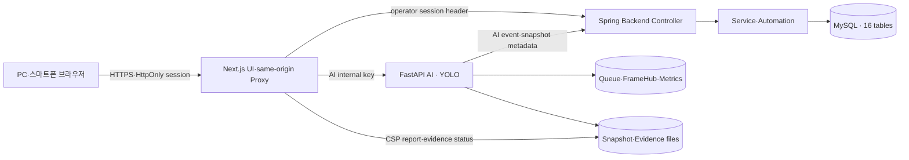
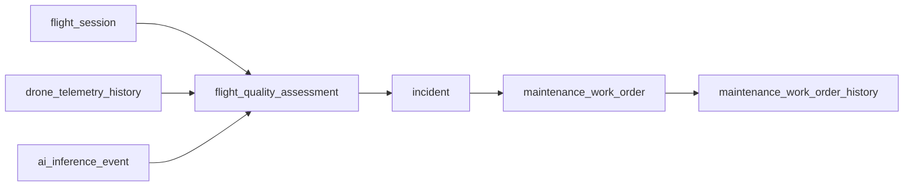

# VisionFlow-Drone 시스템 API·DB 추적성 현행화

> 기준일: 2026-08-02<br>
> 기준 Git 커밋: `fc794e571c39fb3ea1cede7d5509816f483c5664`<br>
> 범위: Next.js Frontend Proxy · Spring Backend · FastAPI AI · Flyway/MySQL · 런타임 저장소<br>
> 상태: `SYSTEM_TRACEABILITY_HEALTHY`

## 1. 목적

이 문서는 기존 API 현행화 문서를 실제 영속 테이블과 기능 흐름으로 확장한다. 각 기능이 어느 API 계층을 통과하고 어떤 DB 테이블 또는 런타임 저장소를 사용하는지 고정하여 다음 변경에서 누락·고아 데이터·잘못된 상관관계를 조기에 찾는 것이 목적이다.

자동 감사는 다음 항목을 소스만 읽어 검증한다.

- Backend Controller 70 operations
- Frontend Route Handler 70 operations
- FastAPI AI 9 operations
- Flyway 생성 테이블 16개
- JPA Entity 15개와 Repository 15개
- 물리 Foreign Key 12개
- API operation과 테이블의 기능 흐름 coverage

DB, 컨테이너, 서비스, 비밀값은 읽거나 변경하지 않는다.

## 2. 전체 구조



주요 책임 경계는 다음과 같다.

- 브라우저는 Backend·AI의 내부 인증값을 직접 보유하지 않는다.
- Next.js가 브라우저 세션을 Backend 인증 헤더로 변환한다.
- Next.js가 AI 내부 서비스 키를 서버 측에서만 추가한다.
- Backend Service가 MySQL 영속화와 자동화 규칙을 담당한다.
- AI 프레임·성능 상태는 프로세스 메모리에 있고, 이벤트 메타데이터는 Backend를 통해 DB에 저장된다.

## 3. 기능 흐름 매트릭스

operation 수는 하나의 API가 둘 이상의 기능 흐름에 참여할 경우 중복 집계될 수 있다.

| 기능 흐름 | Backend | Frontend | AI | 핵심 DB·저장소 |
| --- | ---: | ---: | ---: | --- |
| 플랫폼 상태 | 1 | 0 | 1 | `system_status` 레거시 스키마, runtime health |
| 운영자 인증·감사 | 10 | 10 | 0 | `audit_log`, 세션·로그인 제한 메모리, HttpOnly cookie |
| 운영 대시보드 | 1 | 1 | 0 | `flight_session`, `ai_inference_event`, `audit_log` |
| 통합 시연 시나리오 | 6 | 3 | 0 | `demo_scenario` 및 비행·AI·Incident 계열 |
| 드론·텔레메트리 | 8 | 8 | 0 | `drone`, `drone_telemetry_history`, WebSocket publisher |
| 비행 세션·재생 | 9 | 7 | 0 | `flight_session`, 텔레메트리, AI 이벤트·탐지 |
| 비행 품질·신뢰성 | 6 | 6 | 0 | `flight_quality_assessment`, Incident, 작업지시 |
| 지오펜스 | 6 | 6 | 0 | `drone_geofence`, `drone_geofence_event`, Incident |
| AI 이벤트·경보 영속화 | 8 | 6 | 0 | `ai_inference_event`, `ai_detection`, `ai_alert`, snapshot files |
| AI 영상 입력·추론 스트림 | 0 | 5 | 8 | BrowserUpload queue, FrameHub, Metrics, YOLO state |
| Incident 관리 | 7 | 7 | 0 | `incident`, `incident_action_history`, 증적 context |
| 정비·SLA·비행 허가 | 10 | 10 | 0 | `maintenance_work_order`, history, Incident, 품질 평가 |
| Frontend 로컬 관측 | 0 | 3 | 0 | bounded CSP memory, mobile evidence files |

## 4. 핵심 E2E 데이터 흐름

### 4.1 스마트폰 가상 비행과 AI 추론

1. 브라우저가 `/api/drones/{id}/flight-sessions`를 통해 세션을 시작한다.
2. Backend가 `flight_session`을 만들고 `drone.active_session_id`를 연결한다.
3. 센서 입력은 `drone`의 현재 상태와 `drone_telemetry_history` 이력으로 저장된다.
4. 카메라 프레임은 Next.js `/api/ai/ingest/frame`이 AI `/api/ingest/frame`으로 전달한다.
5. AI는 BrowserUpload queue에서 프레임을 받아 YOLO 추론 후 FrameHub에 주석 영상을 게시한다.
6. 이벤트 게이트를 통과한 결과는 Backend `/api/ai/events`로 전달되어 `ai_inference_event`와 `ai_detection`에 저장된다.
7. snapshot 파일은 파일시스템에 저장되고 경로·크기·해시는 `ai_inference_event`에 기록된다.
8. 경보가 생성되면 `ai_alert`, 필요 시 `incident`와 `incident_action_history`로 이어진다.

텔레메트리와 AI 이벤트가 `session_id`를 포함하면 Backend는 저장 전에 해당
세션의 존재 여부와 `drone_id` 소유권을 공통 Guard로 검증한다. 존재하지 않는
세션은 `RESOURCE_NOT_FOUND`, 다른 Drone 소유 세션은
`FLIGHT_SESSION_DRONE_MISMATCH`로 거부한다. 세션을 포함하지 않는 일반
텔레메트리는 기존과 동일하게 허용한다.

### 4.2 AI 추론 이벤트 수집 직렬화

- AI 이벤트 생성은 세션 소유권을 검증하면서 대상 `flight_session` 행을 먼저
  `PESSIMISTIC_WRITE`로 잠근다.
- 같은 세션의 이벤트 수집은 잠금 획득 뒤
  `(source_id, session_id, frame_index)` 멱등 조회와 신규 저장을 순서대로
  수행한다.
- 동일 프레임 요청이 동시에 도착해도 앞선 저장이 끝난 뒤 후속 요청이 기존
  이벤트를 반환하므로 중복 삽입 예외와 탐지·경보 연쇄 쓰기 중복을 방지한다.
- V5의 `uk_ai_event_frame` UNIQUE 제약은 프레임 중복 생성의 최종 방어선으로
  유지한다.
- 이벤트 목록·상세 데이터 조회는 기존 비잠금 읽기를 유지한다.

### 4.3 AI 경보 생성 직렬화

- AI 경보 생성은 대상 `ai_inference_event` 행을 먼저
  `PESSIMISTIC_WRITE`로 잠근다.
- 이벤트 잠금 획득 뒤 `event_id` 멱등 조회와 신규 경보 저장을 순서대로
  수행하고, 경보가 새로 생성된 경우에만 Incident 연계와 실시간 알림을 실행한다.
- 동일 이벤트의 경보 생성 요청이 동시에 실행돼도 후속 요청은 앞선 트랜잭션이
  만든 경보를 확인하고 추가 부수 효과 없이 종료한다.
- V10의 `uk_ai_alert_event` UNIQUE 제약은 이벤트별 경보 중복 생성의 최종
  방어선으로 유지한다.
- 경보 목록·상세 조회와 이벤트 조회는 기존 비잠금 읽기를 유지한다.

### 4.4 AI 추론 이벤트 스냅샷 첨부 직렬화

- 스냅샷 첨부는 대상 `ai_inference_event` 행을 먼저
  `PESSIMISTIC_WRITE`로 잠근 뒤 파일 저장과 메타데이터 변경을 수행한다.
- 같은 이벤트에 첨부 요청이 동시에 도착해도 앞선 파일·메타데이터 갱신이 끝난 뒤
  후속 요청이 처리되므로 서로의 영속 상태를 비동기적으로 덮어쓰지 않는다.
- 이벤트·스냅샷 조회는 기존 비잠금 읽기를 유지한다.
- 이벤트 수집의 `(source_id, session_id, frame_index)` V5 UNIQUE 제약은
  프레임 중복 생성의 최종 방어선으로 유지한다.

### 4.5 Drone 변경 직렬화

- 기본정보·운영 상태·삭제·텔레메트리 변경은 대상 `drone` 행을 먼저
  `PESSIMISTIC_WRITE`로 잠근다.
- Flight Session 시작과 품질·비행 게이트 Incident 자동화도 기존의 같은 Drone
  잠금 API를 사용하므로 Drone을 기준으로 한 쓰기 순서가 일관된다.
- 텔레메트리는 Drone 잠금 획득 뒤 세션 소유권을 검증하고 현재 상태·이력·Geofence
  평가를 같은 트랜잭션에서 처리한다.
- 동시 상태 변경과 텔레메트리 수신이 서로의 최신 필드를 덮어쓰지 않는다.
- Drone 단건·목록 조회는 기존 비잠금 읽기를 유지한다.
- V2의 `drone_code`·`serial_number` UNIQUE 제약은 생성·변경 충돌의 최종
  방어선으로 유지한다.

### 4.6 비행 품질에서 정비 작업까지



- 품질 평가는 세션·텔레메트리·AI 이벤트를 집계한다.
- 신뢰도 기준을 넘지 못하면 Incident 자동화가 실행될 수 있다.
- Incident는 정비 작업지시와 비행 허가 상태의 근거가 된다.
- 작업 상태 변경은 별도 history에 누적된다.

### 4.7 운영자 인증과 감사

- VIEWER·OPERATOR·ADMIN 원본 KEY는 환경 설정에서만 사용한다.
- 성공한 로그인은 만료형 Backend 세션과 Secure·HttpOnly cookie로 전환된다.
- 세션 registry와 로그인 시도 제한은 프로세스 메모리이며 DB 테이블이 아니다.
- 보안상 중요한 조회·변경은 `audit_log`에 기록된다.
- 강제 세션 종료와 현재 세션 보호는 Backend security API에서 수행한다.

### 4.8 감사 로그 보존 정리 직렬화

- 수동 관리자 실행과 UTC 예약 실행은 공통 `AuditRetentionService.cleanup`
  경로를 사용한다.
- 정리는 오래된 `audit_log` 대상 행을 발생 시각·ID 순서로 조회하면서
  `PESSIMISTIC_WRITE` 잠금을 먼저 획득한 뒤 같은 트랜잭션에서 삭제한다.
- 두 실행이 겹쳐도 같은 행 배치를 동시에 삭제하거나 각 실행의 삭제 건수를
  중복 집계하지 않고, 앞선 배치가 끝난 뒤 남은 대상을 처리한다.
- 보존 상태 조회는 기존 비잠금 개수 조회를 유지한다.
- 활성화·CSV 백업 확인·보존 일수·배치 크기·수동 확인 게이트는 변경하지 않는다.

### 4.9 비행 품질 평가 재계산 직렬화

- 수동 재계산, 비행 세션 종료 후 자동 평가, 강제 백필은 모두 공통
  `FlightQualityAssessmentService.recalculate` 경로를 사용한다.
- 재계산은 대상 `flight_session` 행을 먼저 `PESSIMISTIC_WRITE`로 잠근 뒤
  텔레메트리·AI 이벤트 표본을 읽고 현재 규칙 버전 평가를 저장한다.
- 같은 세션의 재계산 요청이 동시에 실행돼도 앞선 평가 저장이 끝난 뒤 후속 요청이
  최신 평가를 갱신하므로 중복 생성과 오래된 결과 덮어쓰기를 방지한다.
- V16의 `uk_flight_quality_session_rule` UNIQUE 제약은
  `(session_id, rule_version)` 중복 생성의 최종 방어선으로 유지한다.
- 품질 평가 단건·이력 조회는 기존 비잠금 읽기를 유지한다.

### 4.10 Incident 변경과 자동화 직렬화

- 담당자·우선순위·상태·조치 메모 변경은 대상 `incident` 행을 먼저
  `PESSIMISTIC_WRITE`로 잠근다.
- 일반 SLA, 정비 SLA, 비행 품질, 반복 비행 차단 자동화도 같은 Incident
  잠금 API를 사용하므로 운영자 변경과 자동화 결과가 서로 덮어쓰지 않는다.
- 정비 SLA는 Incident 잠금을 획득한 뒤 기존 `SLA_ESCALATED` 이력을 다시
  검사하여 예약 작업의 중복 실행에서도 이력을 한 번만 기록한다.
- 원본 기반 생성은 `(source_type, source_id)` 잠금 조회와 기존
  `uk_incident_source` UNIQUE 제약을 함께 사용해 중복 생성을 방어한다.
- 보고서와 상세 조회는 읽기 전용 조회를 유지하여 불필요한 쓰기 잠금을
  만들지 않는다.
- 통합 시연의 SLA 초과 준비용 직접 SQL도 같은 트랜잭션에서 먼저
  `SELECT ... FOR UPDATE`를 수행한다.

### 4.11 정비 작업지시와 SLA 재평가 직렬화

- 비행 품질 Incident 기반 작업 자동 동기화는 `incident_id`로 작업지시 행을
  `PESSIMISTIC_WRITE` 잠근 뒤 생성·위험 동기화·재개를 수행한다.
- 점검 시작과 완료는 대상 `maintenance_work_order` 행을 ID로 잠근 뒤 상태를
  전이하고 history·감사 로그를 저장한다.
- 정비 SLA 후보 스캔은 작업지시 Entity 대신 ID만 비잠금으로 읽고, 실제 판단
  직전에 `Incident → Maintenance Work Order` 순서로 두 행을 잠근다.
- 잠금 획득 뒤 작업이 여전히 `OPEN`·`IN_PROGRESS`인지 확인하고 SLA를 다시
  계산하므로, 후보 조회 직후 완료된 작업의 Incident를 오래된 상태로 다시
  상향하지 않는다.
- 이 잠금 순서는 비행 품질 자동화의 Incident→작업지시 순서와 일치하여 교착
  가능성을 줄이며, V19 `uk_maintenance_work_order_incident` UNIQUE 제약은
  Incident별 중복 작업 생성의 최종 방어선으로 유지한다.
- 작업 목록·상세와 SLA 현황 조회는 기존 비잠금 읽기를 유지한다.

### 4.12 정비 작전 현황 Frontend

- `/maintenance` 상단은 기존 SLA Incident 추적 응답을 검증한 뒤 작업 접수,
  점검 진행, SLA 대응, 운항 판정을 관제형 단계 카드로 표시한다.
- SLA Incident와 전체 함대 판정의 `evaluatedAt`을 관제 시각과 비교해
  최신·지연·오래됨 상태와 두 소스의 시차를 표시한다. 지연 또는 시차는
  주의 관제, 오래됨은 데이터 갱신 필요로 상단 운영 상태에도 반영한다.
- 전체 함대 비행 허가 응답을 함께 검증하고 각 기체의 `flightAllowed`와
  `attentionRequired`를 비행 가능·점검 대기·운항 중지의 상호 배타적
  구간으로 집계해 도넛 차트와 텍스트 범례를 제공한다.
- 도넛 범례 또는 전체·비행 가능·점검 대기·운항 중지 필터를 선택하면
  같은 기체별 판정 배열에서 해당 기체, Backend 판정 사유, 기체 상세
  링크와 연결된 작업지시 링크를 표시한다.
- 상세 목록은 운항 중지, 점검 대기, 비행 가능 순으로 정렬하며 필터는
  클라이언트 표시 상태만 변경하므로 비행 허가나 작업 상태를 변경하지
  않는다.
- 각 기체의 `관제 상세`는 우측 드로어에서 함대 판정 사유·비행 게이트와
  같은 `workOrderId`의 SLA Incident 상태·담당자·우선순위·권장 대응·마감
  정합성 및 두 소스의 판정 시각을 함께 표시한다. 새 조회나 변경 요청을
  만들지 않고 이미 파싱된 두 응답만 결합한다.
- 드로어는 같은 결합 결과를 함대 게이트→정비 작업지시→Incident·SLA→
  최종 비행 판정의 4단계 근거 타임라인으로도 표시한다. 단계별 중립·진행·
  정상·주의·긴급 색상은 설명을 위한 표현이며 Backend 판정을 다시 계산하지
  않는다.
- 상세 드로어는 modal dialog 의미 구조, Escape 닫기, 배경 스크롤 잠금,
  내부 Tab 포커스 순환과 열기 버튼으로의 포커스 복귀를 제공하고
  기체·작업지시·Incident 보고서 이동만 허용한다.
- SLA 초과·임박, 담당자 지정 필요, 마감 정합성 경고를 우선순위로 정렬해
  상위 3건을 해당 작업지시로 바로 연결한다.
- 브라우저는 same-origin `/api/maintenance/sla/incidents`와
  `/api/maintenance/flight-clearance`만 호출하고, 각 Route Handler가 기존
  운영자 인증을 Backend로 전달한다.
- 30초 자동 갱신과 수동 갱신을 지원하며, 일시적인 실패에서는 이전 정상
  현황을 유지하고 운영자에게 경고한다.
- 이 화면은 읽기 전용 집계이므로 Backend·DB·보안 권한과 기존 작업 전이
  규칙을 변경하지 않는다.

### 4.13 통합 이벤트 관제 Frontend

- `/events`는 기존 same-origin 인증 프록시의 Drone, AI 추론, AI 경보,
  지오펜스 위반, Incident 읽기 응답만 조회한다. Backend API·DB·보안 규칙과
  operation 수는 변경하지 않는다.
- 각 응답은 기존 AI 경보·Incident 파서 또는 이벤트 관제 전용 Drone·AI 추론·
  지오펜스 파서로 검증한 뒤에만 공통 이벤트 모델로 변환한다. 위험도·대응
  상태·발생 시각·기체·원본 ID와 후속 링크 정보는 원본 응답에서만 가져온다.
- 네 이벤트 소스는 `Promise.allSettled`로 독립 조회한다. 일부 소스가 실패하거나
  응답 형식이 잘못되어도 정상 소스와 마지막 유효 데이터는 유지하고, 소스별
  부분 장애를 상단 운영 상태와 접근성 있는 경고로 표시한다.
- 브라우저는 15초 자동 갱신과 수동 갱신을 제공한다. 새 요청은 이전 요청을
  `AbortController`로 취소하고 요청 순번을 확인하므로 늦게 도착한 응답이 최신
  관제 상태를 덮어쓰지 않는다. 숨겨진 탭에서는 자동 조회를 건너뛴다.
- 현재 대응 KPI와 소스 상태, 소스·기체·위험도·대응 상태·시간·검색 필터,
  발생 시각 최신 순 통합 타임라인을 제공하며 최대 표시 건수를 제한한다.
- `관제 상세`는 이미 검증된 공통 이벤트만 받는 읽기 전용 우측 드로어다.
  modal dialog 의미 구조, Escape 닫기, 내부 Tab 포커스 순환, 배경 스크롤 잠금,
  열기 버튼으로 포커스 복귀를 제공하고 기체 상세·세션 리플레이·Incident 보고서
  또는 인증된 탐지 증적 링크만 표시한다. 드로어 자체는 API를 호출하지 않는다.
- `.github/workflows/api-audit.yml`은 `/events` 페이지·구성요소·공통 타입 변경을
  pull request와 `main` push 모두에서 추적성 정책 검사 대상으로 고정한다.

### 4.14 운영 통계 Frontend

- `/statistics`는 기존 same-origin 인증 읽기 프록시인
  `/api/dashboard/operations`, `/api/flight-quality/fleet-reliability`,
  `/api/maintenance/metrics`, `/api/ai/metrics/status`만 조회한다. Backend·AI
  API, DB, 보안 규칙과 operation 수는 변경하지 않는다.
- 비행 세션과 AI 런타임 응답은 운영 통계 전용 파서로 검증하고, 함대 신뢰도와
  정비 KPI는 기존 공용 파서를 재사용한다. 검증되지 않은 응답은 KPI 계산이나
  화면 상태에 반영하지 않는다.
- 네 소스는 `Promise.allSettled`로 독립 조회한다. 일부 소스가 실패하거나 응답
  형식이 잘못되어도 마지막 정상 데이터와 정상 소스는 계속 표시하고, 소스별
  상태와 접근성 있는 부분 장애 안내를 함께 제공한다.
- 30초 자동 갱신과 수동 갱신을 지원한다. 숨겨진 탭에서는 주기 조회를 생략하고,
  `AbortController`와 요청 순번으로 이전 응답이 최신 통계를 덮어쓰지 못하게 한다.
- 7·30·90일 선택은 비행 세션과 정비 작업지시 집계에 적용한다. 함대 신뢰도는
  기체별 최신 최대 20개 품질 평가, AI 성능은 현재 런타임 롤링 스냅샷, 비행
  허가는 최신 함대 판정임을 화면에 명시해 서로 다른 표본 범위를 혼동하지 않게 한다.
- 완료율·품질 점수·탐지율·정비 해결률, 세션·작업지시 분포, 기체별 품질 추세와
  함대 비행 허가를 읽기 전용으로 제공하고 기존 운영·신뢰도·정비·AI 상세 화면만
  연결한다. 브라우저 변경 요청은 만들지 않는다.
- `.github/workflows/api-audit.yml`은 `/statistics` 페이지·구성요소·공통 타입
  변경을 pull request와 `main` push 모두에서 추적성 정책 검사 대상으로 고정한다.

### 4.15 AI 경보 확인·해결 직렬화

- 운영자 확인과 해결 요청은 대상 `ai_alert` 행을 먼저
  `PESSIMISTIC_WRITE`로 잠근 뒤 상태·처리자·메모를 변경한다.
- 같은 경보의 확인과 해결 요청이 동시에 도착해도 먼저 완료된 변경을 오래된
  트랜잭션이 덮어쓰지 않으며, 연동된 Incident 동기화도 같은 순서로 수행된다.
- 통합 시연의 경보 해결 경로도 공통 `AiAlertService.resolve`를 사용하므로 같은
  잠금 정책을 따른다.
- 경보 목록과 상세 조회는 비잠금 읽기를 유지한다.
- 이벤트별 경보 생성은 기존 `uk_ai_alert_event` UNIQUE 제약을 최종 중복 생성
  방어선으로 유지한다.

### 4.16 Geofence 위반 이벤트 직렬화

- 지오펜스 설정 변경·활성 상태 변경·텔레메트리 위반 평가는 대상
  `drone_geofence` 행을 먼저 `PESSIMISTIC_WRITE`로 잠근다.
- 비활성화와 위반 평가가 동시에 실행돼도 잠금 획득 뒤 활성 상태를 다시 확인하므로
  비활성 지오펜스에 새 위반 이벤트를 만들지 않는다.
- 동일 Drone·Geofence 조합의 미해결 이벤트는 V23의 generated column 기반
  `uq_geofence_event_one_active_per_drone_zone` UNIQUE 제약으로 한 건만 허용한다.
- V23 적용 전 읽기 전용 데이터 정합성 감사가 기존 ACTIVE 중복을 검사하며,
  발견 시 migration 적용 전에 차단한다.
- 목록·상세 조회는 기존 비잠금 읽기를 유지한다.

### 4.17 Demo Scenario 단계 전이 직렬화

- 탐지·에스컬레이션·해결·완료는 대상 `demo_scenario` 행을 먼저
  `PESSIMISTIC_WRITE`로 잠근다.
- 같은 단계가 동시에 요청돼도 첫 트랜잭션이 다음 단계와 외부 연쇄 쓰기를 완료한
  뒤 후속 요청이 현재 단계를 다시 검증하므로 AI 이벤트·경보·Incident·비행 세션
  변경을 중복 실행하지 않는다.
- 단계별 외부 쓰기는 시나리오 잠금 획득 뒤에만 실행한다.
- 시나리오 단건 조회는 기존 비잠금 읽기를 유지한다.

## 5. DB 테이블·Entity·Repository 현황

| Table | Flyway | Entity | Repository | 분류 |
| --- | --- | --- | --- | --- |
| `system_status` | V1 | 없음 | 없음 | 레거시 스키마 |
| `drone` | V2 | `Drone` | `DroneRepository` | Core |
| `drone_telemetry_history` | V3 | `DroneTelemetryHistory` | `DroneTelemetryHistoryRepository` | Core |
| `drone_geofence` | V4 | `DroneGeofence` | `DroneGeofenceRepository` | Core |
| `drone_geofence_event` | V4 | `DroneGeofenceEvent` | `DroneGeofenceEventRepository` | Core |
| `ai_inference_event` | V5 | `AiInferenceEvent` | `AiInferenceEventRepository` | Core |
| `ai_detection` | V5 | `AiDetection` | `AiDetectionRepository` | Core |
| `flight_session` | V9 | `FlightSession` | `FlightSessionRepository` | Core |
| `ai_alert` | V10 | `AiAlert` | `AiAlertRepository` | Core |
| `incident` | V11 | `Incident` | `IncidentRepository` | Core |
| `incident_action_history` | V11 | `IncidentActionHistory` | `IncidentActionHistoryRepository` | History |
| `demo_scenario` | V14 | `DemoScenario` | `DemoScenarioRepository` | Demo |
| `audit_log` | V15 | `AuditLog` | `AuditLogRepository` | Audit |
| `flight_quality_assessment` | V16 | `FlightQualityAssessment` | `FlightQualityAssessmentRepository` | Core |
| `maintenance_work_order` | V19 | `MaintenanceWorkOrder` | `MaintenanceWorkOrderRepository` | Core |
| `maintenance_work_order_history` | V19 | `MaintenanceWorkOrderHistory` | `MaintenanceWorkOrderHistoryRepository` | History |

`system_status`는 Flyway V1에 존재하지만 현재 HealthService는 DB를 조회하지 않는다. 삭제·재사용 여부는 별도 migration 결정으로 처리하며 현 단계에서는 자동 변경하지 않는다.

## 6. 물리 FK 12개

| From | To | 삭제 의미 |
| --- | --- | --- |
| `drone_telemetry_history.drone_id` | `drone.id` | V21부터 기체 삭제 `RESTRICT`; 텔레메트리 이력 보존 |
| `drone_geofence_event.geofence_id` | `drone_geofence.id` | 지오펜스 삭제 연계 |
| `ai_detection.event_id` | `ai_inference_event.id` | 이벤트 삭제 시 탐지 CASCADE |
| `flight_session.drone_id` | `drone.id` | V21부터 기체 삭제 `RESTRICT`; 세션 이력 보존 |
| `ai_alert.event_id` | `ai_inference_event.id` | 이벤트 삭제 시 경보 CASCADE |
| `incident_action_history.incident_id` | `incident.id` | Incident 삭제 시 이력 CASCADE |
| `flight_quality_assessment.session_id` | `flight_session.session_id` | 세션 삭제 시 평가 CASCADE |
| `flight_quality_assessment.drone_id` | `drone.id` | V21부터 기체 삭제 `RESTRICT`; 품질 평가 보존 |
| `maintenance_work_order.incident_id` | `incident.id` | Incident 삭제 시 작업 CASCADE |
| `maintenance_work_order.drone_id` | `drone.id` | 기체 삭제 `RESTRICT`; 정비 작업 보존 |
| `maintenance_work_order.source_assessment_id` | `flight_quality_assessment.id` | 평가 삭제 시 참조 NULL |
| `maintenance_work_order_history.work_order_id` | `maintenance_work_order.id` | 작업 삭제 시 이력 CASCADE |

## 7. 소프트 상관관계와 정합성 위험

다음 연결은 물리 FK만으로 완전히 보장되지 않는다.

| 상관키 | 범위 | 위험·검증 기준 |
| --- | --- | --- |
| `session_id` | 세션·텔레메트리·AI 이벤트·경보·Incident·Demo·정비 | 문자열 UUID 연결이므로 고아 값과 세션 소유 기체 불일치를 정례 검사 |
| `drone_id` | AI·경보·Incident·Demo 등 | 일부 테이블은 FK 없이 서비스 검증에 의존하므로 존재하지 않는 기체 ID 검사 |
| `source_type + source_id` | Incident 다형 소스 | source type별 대상 테이블 존재 여부와 UNIQUE 계약 검사 |
| `snapshot_path` | DB와 파일시스템 | DB 참조·실제 JPG 수·크기·SHA-256 일치 검사 |

41개 DB 상관관계·수명주기 규칙과 5개 snapshot 규칙은 읽기 전용 데이터 정합성 감사로 통합되어 있으며, 기존 운영 가드의 기본 30분 주기에서도 함께 실행된다. 기체별 ACTIVE 비행 세션 중복과 Drone·Geofence 조합별 미해결 위반 이벤트 중복도 이 범위에서 차단한다. 문제를 발견해도 자동 복구하거나 행을 삭제하지 않는다.

## 8. 런타임 전용 상태

다음 상태는 MySQL에 영속되지 않으므로 컨테이너 재시작 시 초기화되는 것이 정상이다.

- 운영자 세션 registry와 로그인 실패 제한
- AI BrowserUpload queue
- AI AnnotatedFrameHub 최신 프레임과 연결 수
- AI 성능 metric 누적값
- Frontend CSP report bounded memory

반면 다음 파일 기반 상태는 DB와 함께 검증해야 한다.

- AI event snapshot JPG
- 모바일 HTTPS 인증서와 metadata
- 모바일 증적 보고서
- 감사·계약·보안·운영 가드 산출물

### 8.1 Frontend standalone 파일 추적 경계

- 모바일 증적 loader는 운영 환경의
  `VISIONFLOW_MOBILE_EVIDENCE_DIRECTORY`와 Frontend 프로젝트 내부 기본
  `artifacts/mobile-readiness`만 후보로 사용한다. 저장소 상위 경로를
  거슬러 올라가는 fallback은 허용하지 않는다.
- Compose는 운영 후보를 `/app/artifacts/mobile-readiness`에 읽기 전용으로
  마운트하며, Route Handler는 Node.js runtime·동적 응답·`no-store`를 유지한다.
- 허용 패턴으로 선별한 보고서와 체크섬의 동적 경로에는
  `turbopackIgnore: true`를 적용한다. 런타임 검증·SHA-256·심볼릭 링크·크기
  제한은 유지하면서 Next.js `output: "standalone"`의 NFT가 저장소 전체를
  의도치 않게 추적하지 않도록 한다.
- `frontend-output-file-tracing-policy`는 경로 범위, 세 개의 추적 제외 표식,
  Docker 읽기 전용 마운트와 standalone 설정을 CI에서 함께 고정한다.

### 8.2 GitHub Actions Node.js 24 실행 경계

- API·보안·시스템 추적성 workflow는 `actions/checkout@v6`,
  `actions/setup-python@v6`, `actions/upload-artifact@v7`만 사용한다.
- Node.js 20 강제 허용 변수는 사용하지 않으며, 추적성 정책 단위 테스트를
  정적 감사 전에 실행한다.
- 추적성 테스트 파일 변경은 pull request와 `main` push 모두 workflow를
  실행하며 `github-actions-node24-runtime-policy`가 Action 버전·실행 단계·
  경로 trigger를 함께 고정한다.

## 9. 자동 감사 실행

저장소 루트에서 실행한다.

```bat
scripts\run-visionflow-system-traceability-audit.bat
```

정상 기준은 다음과 같다.

```text
VisionFlow system traceability audit: SYSTEM_TRACEABILITY_HEALTHY
Operations: Backend=70, Frontend=71, AI=9
Data model: Tables=16, Entities=15, Repositories=15, ForeignKeys=12
```

보고서는 `artifacts/system-traceability-audit` 아래에 JSON·HTML·Markdown으로 생성된다.

## 10. 변경 관리 원칙

- API를 추가하거나 제거하면 기능 흐름과 operation 기준 수를 함께 갱신한다.
- 테이블·Entity·Repository·FK 변경은 Flyway migration과 기준선을 같은 커밋에서 검토한다.
- DB가 없는 런타임 상태를 억지로 테이블에 연결하지 않는다.
- 소프트 상관관계를 물리 FK로 전환할 때 기존 데이터 정리·백업·복구 계획을 먼저 마련한다.
- 기준선 갱신은 감사 실패를 숨기는 용도로 사용하지 않는다.

## 11. 다음 데이터 품질 작업

완료된 데이터 품질 경계는 다음과 같다.

- `session_id`, `drone_id`, `source_type + source_id` 고아·불일치 읽기 전용 감사
- historical flight session 복구와 Drone 이력 삭제 재발 방지
- 텔레메트리·AI 이벤트 외부 입력의 세션 존재·Drone 소유권 쓰기 방어
- Drone·비행 세션 행 잠금과 DB UNIQUE 제약을 통한 기체별 단일 ACTIVE 세션 보장
- AI 이벤트 행 잠금과 V10 UNIQUE 제약을 통한 경보·Incident 연계 중복 방지
- 운영 가드 기반 정기 감시와 자동 복구 금지

다음 후보는 아래 순서로 검토한다.

1. API별 생성량 상한 설계
2. 테스트·발표·실운영 데이터 태그 설계
3. `system_status` 레거시 테이블의 유지·제거 결정

이 문서는 코드 구조가 아니라 실제 API·DB·런타임 책임 경계를 기준으로 관리한다.
